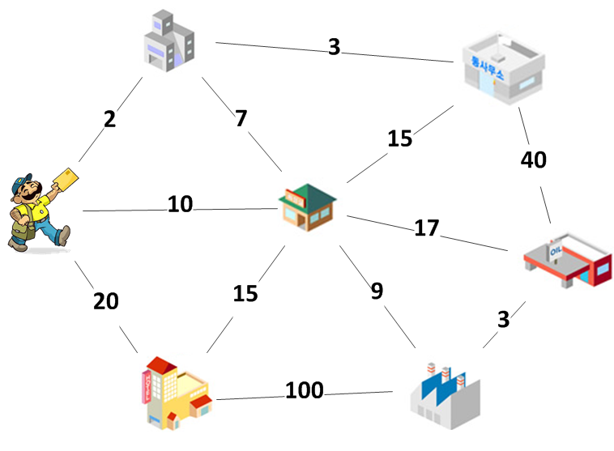

::: {.frame}
::: {.center}
Setor de Educação Profissional e Tecnológica\
Tecnologia em Análise e Desenvolvimento de Sistemas\
Tópicos Especiais de Análise e Desenvolvimento de Sistemas
:::
:::

::: {.frame}
Roteiro
:::

# Caixeiro Viajante

::: {.frame}
### Problema do Caixeiro Viajante

::: {.block}
Definição Suponha que um caixeiro viajante tenha de visitar n cidades
diferentes, iniciando e encerrando sua viagem na primeira cidade.
Suponha, também, que não importa a ordem com que as cidades são
visitadas e que de cada uma delas pode-se ir diretamente a qualquer
outra. O problema do caixeiro viajante consiste em descobrir a rota que
torna mínima a viagem total.
:::
:::

::: {.frame}
### Problema do Caixeiro Viajante

{#label width="8cm"}
:::

::: {.frame}
### Problema do Caixeiro Viajante

::: {.center}
Qual a solução mais simples para esse problema??\
Verificar **todas as possibilidades**.
:::
:::

::: {.frame}
### Problema do Caixeiro Viajante

::: {.center}
Considere o problema com 4 cidades ($n=4$): $A$, $B$, $C$ ,$D$.\
Quais são as possibilidades?
:::

1.  ABCDA

2.  ABDCA

3.  ACBDA

4.  ACDBA

5.  ADBCA

6.  ADCBA

E para 5 cidades, quantas rotas são possíveis? E para 6 cidades?
:::

::: {.frame}
### Análise do Problema

-   Clássico problema de **otimização combinatória**;

-   Solução anterior, reduz para um **problema de enumeração** e
    consegue encontrar a solução ótima;

Legal! Encontramos a solução. Então por que estamos falando desse
problema?\
Qual o problema dessa solução?

::: {.center}
O esforço cresce em uma taxa **fatorial**!
:::
:::

::: {.frame}
### Análise do Problema

Suponha:

-   Um computador muito veloz capaz de fazer 1 bilhão de adições por
    segundo;

-   Um problema com 20 cidades.

O computador precisa de apenas 19 adições para dizer qual o comprimento
de uma rota. Portanto:

-   É capaz de calcular $10^9 / 19 =$**53 milhões de rotas por
    segundo**;

-   Ótimo, não?

Sabemos que o computador precisará calcular $19!$ rotas. Quanto é $19!$?

::: {.center}
$121645100408832000$
:::

Assim, o computador precisará de

::: {.center}
$1.2 \times 10^{17} / ( 53$milhões$) = 2.3 x 10^9$ segundos
:::
:::

::: {.frame}
### Análise do Problema

::: {.center}
$2.3 x 10^9$ segundos\
$= 2300000000$ segundos\
$= 38333333$ minutos\
$= 638888$ horas\
$= 26620$ dias\
$= 73$ **anos**!\
:::

"Ah, mas tudo bem! É só alocar mais processamento. Se tivermos um
computador 1000 vezes mais rápido, quanto tempo leva?"

::: {.center}
$73$ anos $/ 1000 = 0,073$ anos $= 26$ dias\
:::

Com esse novo computador e uma única cidade a mais, já levaríamos mais
de um ano para calcular a melhor rota.
:::

::: {.frame}
### Análise do Problema

::: {#my-label}
  **n**   **rotas por segundo**   **( n - 1 )!**    **cálculo total**
  ------- ----------------------- ----------------- ---------------------
  5       250 milhoes             24                insignific
  10      110 milhoes             362 880           0.003 seg
  15      71 milhoes              87 bilhoes        20 min
  20      53 milhoes              1.2 x $10^{17}$   73 anos
  25      42 milhoes              6.2 x $10^{23}$   470 milhoes de anos

  : Crescimento Fatorial.
:::
:::

::: {.frame}
### Análise do Problema

::: {#my-label}
  **n**   **rotas por segundo**   **$n^5$**   **cálculo total**
  ------- ----------------------- ----------- -------------------
  5       250 milhoes             3 125       insignific
  10      110 milhoes             100 000     insignific
  15      71 milhoes              759 375     0.01 seg
  20      53 milhoes              3 200 000   0.06 seg
  25      42 milhoes              9 765 625   0.23 seg

  : Crescimento Polinomial
:::
:::

# Problemas Complexos

::: {.frame}
### Problemas Complexos

E o que tudo isso quer dizer??

::: {.center}
Que nem todos os problemas são facilmente resolvidos de maneira
satisfatória por um computador.
:::

Mas não existe um algoritmo melhor?

::: {.center}
Algoritmo ótimo? A princípio não. Se você descobrir, pode se considerar
um milionário. :)
:::
:::

::: {.frame}
### Classes de problemas

De uma maneira ***muito simplificada***, podemos dividir problemas em 2
grupos:

::: {.block}
Problemas **P** Problemas resolvíveis em tempo polinomial (de acordo com
o tamanho da entrada).
:::

::: {.block}
Problemas **NP** Problemas **não** resolvíveis em tempo polinomial (de
acordo com o tamanho da entrada).

-   *"Non-deterministic polynomial time"*;

-   Mas verificáveis em tempo polinomial;

-   Redução de problemas;
:::

::: {.center}
**P = NP ??**
:::
:::

# Análise de Algoritmos

::: {.frame}
### Análise de Algoritmos

O que a teoria de computação tem a oferecer para que possamos entender
qual o tipo de problemas que estamos tratando e se seus algoritmos são
bons?

::: {.block}
Análise de Algoritmos Estuda a correção e o desempenho de algoritmos. Em
outras palavras, a análise de algoritmos procura respostas para
perguntas do seguinte tipo:

-   "Este algoritmo resolve o meu problema?";

-   "Quanto tempo o algoritmo consome para processar uma 'entrada' de
    tamanho n?".
:::
:::

::: {.frame}
Análise de Algoritmos

-   Comparar algoritmos:

    -   Qual algoritmo é melhor para uma tarefa?

-   Duas abordagens:

    -   Análise empírica;

    -   Análise de Algoritmos.
:::

::: {.frame}
Análise Empírica

-   Bastante simples:

    -   Implementa os algoritmos e testa.

-   Funciona bem em alguns casos. Mas nem sempre/

-   Obstáculos para a análise empírica:

    -   Implementar corretamente;

    -   Determinar um conjunto de dados de entrada:

        -   Real;

        -   Aleatório;

        -   "Perverso";

        -   Dependerá da aplicação.

    -   Desempenho da máquina.
:::

::: {.frame}
Escolha de um Algoritmo

-   Qual algoritmo escolher dada uma análise empírica?

-   Problemas:

    -   Valorizar pouco o desempenho;

    -   Valorizar demais o desempenho.

-   Não é possível realizar sempre uma análise empírica:

    -   Demanda tempo e esforço.

-   É necessário ser capaz de ter noção do desempenho do algoritmo.

Para isso, temos o estudo da **complexidade de algoritmos**.
:::

::: {.frame}
Exemplo

Quantas vezes o seguinte algoritmo imprime \"Ola mundo\"?
:::

::: {.frame}
Exemplo

E agora?
:::

::: {.frame}
Exemplo

E esse?
:::

::: {.frame}
Exemplo

E agora?
:::

::: {.frame}
Complexidade de Algoritmos

Dizemos que, **no pior caso**, os tempos de execução dos algoritmos
anteriores crescem da seguinte maneira:

1.  Proporcionalmente ao tamanho de $n$ ($O(n)$);

2.  Proporcionalmente ao tamanho de $n^2$ ($O(n^2)$);

3.  Proporcionalmente ao tamanho de $n^3$ ($O(n^3)$);

4.  Proporcionalmente ao tamanho de $n^2$ ($O(n^2)$);

Com estudos assim, podemos comparar algoritmos independentemente do
computador utilizado.
:::

::: {.frame}
Crescimento de Funções

{#label width="9cm"}
:::

# Exemplo: Bubble Sort

::: {.frame}
Exemplo: Ordenação

::: {.block}
Problema da Ordenação Ordenação é o ato de se colocar os elementos de
uma sequência de informações, ou dados, em uma ordem predefinida.
:::

1.  Algoritmo Bubble Sort (Bolha)??

    1.  Fazer trocas sucessivas dois a dois até que o maior elemento
        esteja na última posição;

    2.  Repetir $n-1$ vezes.
:::

# Exemplo: Fibonacci

::: {.frame}
Série de Fibonacci

::: {.center}
$$fib(n) =
            \left \{
            \begin{array}{rc}
                0,&\mbox{se}\quad n = 0,\\
                1,&\mbox{se}\quad n = 1,\\
                fib(n-1) + fib(n-2),&\mbox{se}\quad n \ge 2.
            \end{array}
            \right .$$
:::
:::

::: {.frame}
Algoritmo 1
:::

::: {.frame}
Algoritmo 2
:::

# Conclusão

::: {.frame}
### Considerações Finais

Por que falar de tudo isso em um curso de análise e desenvolvimento?

-   Sistemas resolvem problemas cada vez mais **complexos**;

    -   Saber identificar se um problema tem solução computacional ou
        não;

    -   Exemplo: Como o waze calcula o menor caminho?

    -   Exemplo: BigData.

-   Entender diferentes técnicas de algoritmos;

-   Comparar e escolher soluções para um problema;

-   Enfim, se tornar um programador melhor;

Obrigado!
:::
