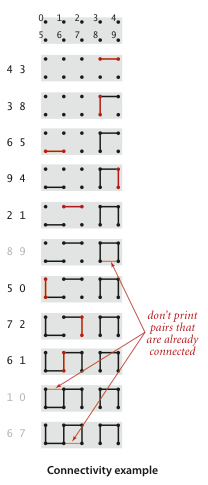

# Aula 01 — Introdução a Go e Estudo de caso Union-Find

## Roteiro da aula

1. Apresentação da disciplina (plano de ensino, avaliações, cronograma)
2. Introdução à linguagem Go
3. Estudo de caso: Union-Find (conectividade dinâmica)

---

## 1. Introdução à linguagem Go

### Por que Go?

Go (ou Golang) é uma linguagem criada no Google em 2009 por Robert Griesemer, Rob Pike e Ken Thompson. Características principais:

- **Compilada e estaticamente tipada**: segurança de tipos em tempo de compilação, sem custo de interpretação
- **Sintaxe enxuta**: sem classes, herança, exceções ou sobrecarga de operadores
- **Gerenciamento automático de memória**: garbage collector, sem `malloc`/`free` manual
- **Concorrência nativa**: goroutines e channels como primitivas da linguagem
- **Ferramentas integradas**: `go fmt`, `go test`, `go build`, `go mod` — tudo no toolchain padrão
- **Compilação cruzada**: um binário estático para qualquer sistema operacional

### Olá, mundo

```go
package main

import "fmt"

func main() {
    fmt.Println("Olá, Estruturas de Dados II!")
}
```

- Todo programa Go começa no pacote `main`, função `main()`
- `import` traz pacotes da biblioteca padrão
- `fmt.Println` → análogo ao `printf` com quebra de linha

### Tipos básicos

```go
var idade int = 20          // declaração explícita
nome := "Alex"              // inferência de tipo (:= só na primeira atribuição)
var altura float64 = 1.75
var ativo bool = true
```

Tipos básicos: `int`, `int32`, `int64`, `float32`, `float64`, `bool`, `string`, `byte` (alias para `uint8`), `rune` (alias para `int32`, representa um caractere Unicode).

### Structs

Substituem os `struct` de C. Podem ter **métodos** associados.

```go
type Aluno struct {
    Nome string
    GRR  string
    Nota float64
}

// Método: função com receiver (a *Aluno)
func (a *Aluno) EstaAprovado() bool {
    return a.Nota >= 70
}

func main() {
    aluno := Aluno{Nome: "Maria", GRR: "20261234", Nota: 85}
    fmt.Println(aluno.EstaAprovado()) // true
}
```

**Ponteiro receiver (`*Aluno`)**: altera o valor original. **Value receiver (`Aluno`)**: trabalha em uma cópia (não modifica o original). Em estruturas de dados, usaremos quase sempre ponteiros.

### Ponteiros

Go tem ponteiros, como C, mas **sem aritmética de ponteiros**.

```go
x := 10
p := &x       // p é um *int (ponteiro para int)
*p = 20       // desreferencia: altera x para 20
fmt.Println(x) // 20
```

Go não tem `->`; use `.` tanto para valores quanto para ponteiros:

```go
type Ponto struct{ X, Y int }
p := &Ponto{3, 4}
fmt.Println(p.X) // 3 — o compilador desreferencia automaticamente
```

### Slices

Slices são a principal estrutura para sequências em Go. Diferente de arrays C, slices têm **tamanho dinâmico** e são seguras (bounds checking).

```go
// Criando slices
numeros := []int{10, 20, 30, 40} // slice literal
vazio := make([]int, 10)          // slice de 10 zeros, usando make

// Operações
numeros = append(numeros, 50)     // adiciona elemento (realoca se necessário)
fatia := numeros[1:3]             // slicing: [20, 30] (índice 1 inclusive, 3 exclusive)
fmt.Println(len(numeros))         // comprimento: 5
fmt.Println(cap(numeros))         // capacidade (memória alocada)
```

### Maps

Tabela de dispersão nativa da linguagem (hash table).

```go
notas := map[string]float64{
    "Alice": 85.5,
    "Bob":   72.0,
}

notas["Carlos"] = 91.0           // inserção
delete(notas, "Bob")             // remoção

valor, existe := notas["Bob"]    // lookup seguro: "comma ok idiom"
if existe {
    fmt.Println(valor)
}
```

### Interfaces

Interfaces definem **comportamento** (conjunto de métodos). Em Go, a implementação é **implícita** — um tipo satisfaz uma interface se possui todos os métodos com as assinaturas corretas.

```go
type Figura interface {
    Area() float64
}

type Retangulo struct{ Largura, Altura float64 }
func (r Retangulo) Area() float64 { return r.Largura * r.Altura }

type Circulo struct{ Raio float64 }
func (c Circulo) Area() float64 { return 3.14 * c.Raio * c.Raio }

func imprimirArea(f Figura) {
    fmt.Printf("Área: %.2f\n", f.Area())
}

func main() {
    imprimirArea(Retangulo{10, 5}) // Área: 50.00
    imprimirArea(Circulo{3})       // Área: 28.26
}
```

Isso será útil para definir a API Union-Find como uma interface e implementar múltiplas versões do algoritmo.

### Ferramentas básicas

```bash
go run main.go          # compila e executa (útil para testes rápidos)
go build                # compila para binário
go test                 # executa testes unitários
go fmt ./...            # formata o código automaticamente
```

### Referências para aprender Go

- [A Tour of Go](https://go.dev/tour/welcome/1) — tutorial interativo oficial
- [Effective Go](https://go.dev/doc/effective_go) — guia de estilo idiomático
- [Go by Example](https://gobyexample.com/) — exemplos comentados por tópico
- [The Go Programming Language Specification](https://go.dev/ref/spec) — especificação completa

---

## 2. Estudo de caso — Union-Find

### O problema da Conectividade Dinâmica

Imagine uma rede de computadores, onde cada computador é identificado por um
número inteiro entre `0` e `N-1`. Sabemos que alguns pares de computadores já
estão fisicamente conectados por um cabo, mas não temos o mapa completo da
rede — apenas uma lista de conexões, uma por linha, no formato `p q` (o
computador `p` está conectado ao computador `q`).

A pergunta que queremos responder repetidamente é: **dado um novo par `p q`,
os dois computadores já pertencem à mesma rede** (mesmo que a conexão entre
eles não seja direta, mas por meio de outros computadores)**?**

Chamamos essa relação de "pertencer à mesma rede" de **conectividade**. Ela
se comporta como uma **relação de equivalência**, ou seja, satisfaz três
propriedades:

- *Reflexiva*: todo computador está conectado a si mesmo (`p` — `p`);
- *Simétrica*: se `p` está conectado a `q`, então `q` está conectado a `p`;
- *Transitiva*: se `p` está conectado a `q`, e `q` está conectado a `r`, então
  `p` está conectado a `r` — mesmo que não exista um cabo direto entre `p` e
  `r`.

Toda relação de equivalência particiona o conjunto de objetos em grupos
disjuntos chamados **componentes conexas** (ou apenas **componentes**): dois
computadores estão na mesma componente se, e somente se, estão conectados
(direta ou indiretamente). Inicialmente, antes de qualquer conexão, cada um
dos `N` computadores forma sua própria componente, com apenas um elemento.

Para representar isso computacionalmente, identificamos cada componente pelo
número de um dos computadores que a compõem (seu **identificador**). Dois
computadores têm o mesmo identificador de componente se, e somente se,
pertencem à mesma componente.

### O programa que vamos construir

O programa lê pares `p q` da entrada, um por vez, e decide o que fazer com
cada um:

1. Se `p` e `q` **já** estão na mesma componente, a conexão é redundante — já
   sabíamos que eles estavam ligados — então o programa **não imprime nada**
   e passa para o próximo par.
2. Caso contrário, o programa **imprime o par** (essa é uma conexão nova e
   relevante) e registra que, a partir de agora, `p` e `q` pertencem à mesma
   componente.

Note que o programa nunca recebe a rede completa de uma vez: ele descobre a
conectividade **incrementalmente**, à medida que lê os pares — por isso o
nome *conectividade dinâmica*.

### API Union-Find em Go

Abaixo está a API Union-Find. Ela encapsula as operações básicas que precisamos:

```go
// UF representa uma estrutura Union-Find (conectividade dinâmica).
type UF struct {
    id    []int // slice para armazenar a componente de cada elemento
    n     int   // número de elementos
    count int   // contagem de componentes atual
}

// NewUF inicializa N itens com identificadores inteiros (0 até N-1).
func NewUF(n int) *UF

// Count retorna o número de componentes.
func (uf *UF) Count() int

// Connected retorna true se p e q estão na mesma componente.
func (uf *UF) Connected(p, q int) bool

// Find retorna o identificador da componente de p (0 até N-1).
func (uf *UF) Find(p int) int

// Union adiciona conexão entre p e q.
func (uf *UF) Union(p, q int)
```

O identificador de uma componente pode mudar apenas a partir
de uma chamada ao método `Union`. Este identificador **não** pode
ser alterado pelos métodos `Find`, `Connected` ou `Count`.



### Código de apoio

O arquivo [uf.go](01/uf.go) resolve parcialmente o problema da conectividade
dinâmica em Go. Os métodos `Find` e `Union` estão com implementações vazias
— **esse é o desafio de vocês!** O programa lê pares da entrada e imprime
apenas as conexões que não são redundantes.

Dados para testar o programa também estão disponíveis:

- O arquivo [tinyUF.txt](01/tinyUF.txt) contém 11 conexões indicadas na figura acima;
- O arquivo [mediumUF.txt](01/mediumUF.txt) contém 900 conexões;
- O arquivo [largeUF.txt](01/largeUF.txt) contém milhões de conexões.

Para executar:

```bash
cd 01
go run uf.go < tinyUF.txt
```

### Desafio

Considere um slice (`[]int`) como a estrutura de dados básica para armazenar as
informações sobre cada item. Por exemplo, `id[0]` armazena a qual componente o
item 0 pertence. Existem diferentes implementações para os métodos `Union` e `Find`.
Qual seria a mais eficiente que você consegue pensar?

**Tente resolver essa questão sem procurar por alternativas na internet. Se desafie!**

## Referências (consulte apenas depois de fazer sua própria solução)

- [Sedgewick - Union-find (em inglês)](https://algs4.cs.princeton.edu/15uf/)
- [Sedgewick - Union-find Slides (em inglês)](https://algs4.cs.princeton.edu/lectures/keynote/15UnionFind.pdf)
- [A Tour of Go](https://go.dev/tour/welcome/1)
- [Go by Example](https://gobyexample.com/)
