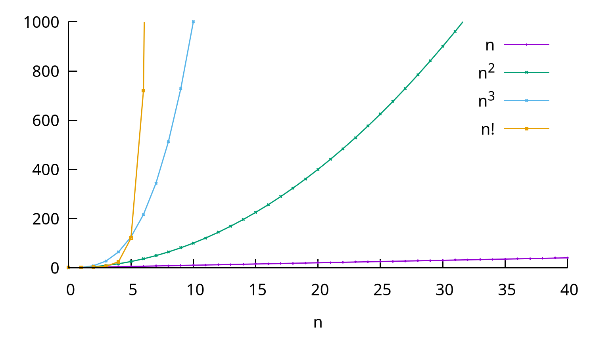

# Análise de Algoritmos e Conectividade Dinâmica

[Slides desta aula (PDF)](02/analise_alg/analise_alg.pdf)

## Bibliografia recomendada para o tema

* SEDGEWICK, R.; WAYNE, K. **Algorithms**, 4th ed., seções 1.4 (*Analysis of
  Algorithms*) e 1.5 (*Case Study: Union-Find*);
* [algs4 - Analysis of Algorithms](https://algs4.cs.princeton.edu/14analysis/);
* [algs4 - Union-Find](https://algs4.cs.princeton.edu/15uf/);
* [algs4 - Slides de Union-Find (em inglês)](https://algs4.cs.princeton.edu/lectures/keynote/15UnionFind.pdf);
* BHARGAVA, Aditya Y. **Entendendo Algoritmos**, cap. 1 e 4

## Objetivos da aula

Ao final desta aula você deve ser capaz de:

1. Contar quantas operações um trecho de código executa em função do tamanho `n`
   da entrada;
2. Identificar o termo dominante de uma função de custo e justificar por que os
   demais podem ser descartados;
3. Classificar uma função de custo com as notações O, Ω e Θ, dizendo o que cada
   uma afirma;
4. Distinguir melhor caso, pior caso e caso médio, e informar qual deles a sua
   análise descreve;
5. Estimar a ordem de crescimento de um programa a partir de medições de tempo,
   pela hipótese de duplicação;
6. Explicar as três implementações de Union-Find do livro do Sedgewick e o custo
   de `Find` e `Union` em cada uma;
7. Justificar por que pendurar a árvore menor sob a maior reduz o custo de $O(n)$
   para $O(\log n)$;
8. Escolher, para um tamanho de entrada dado, qual das três implementações usar.

## 1. Três programas, a mesma resposta, tempos diferentes

Na aula de introdução a Go, o desafio foi implementar `Find` e `Union` no arquivo
[uf.go](01/uf.go). Existe mais de uma forma de fazer isso, e as diferenças entre
elas não aparecem na saída do programa. Aparecem no desempenho.

Os três programas abaixo resolvem o mesmo problema de conectividade dinâmica.
Compile os três:

```bash
cd 02/codes/unionfind
go build -o quick_find quick_find.go
go build -o quick_union quick_union.go
go build -o weighted weighted_quick_union.go
```

Rode os três com o arquivo pequeno de teste usado na aula anterior:

```bash
./quick_find  < tinyUF.txt
./quick_union < tinyUF.txt
./weighted    < tinyUF.txt
```

A saída é idêntica nos três casos: as mesmas oito conexões, na mesma ordem.

```
4 3
3 8
6 5
9 4
2 1
5 0
7 2
6 1
```

O arquivo tem 10 objetos e 11 pares. Oito pares produziram conexão nova, três
eram redundantes, e sobraram duas componentes ao final.

Agora rode com o arquivo grande, `largeUF.txt`, que tem 1 milhão de objetos e 2
milhões de pares. Comece pelo terceiro programa:

```bash
time ./weighted < largeUF.txt > /dev/null
```

Cerca de um segundo. Agora tente o primeiro, `quick_find`, com o mesmo arquivo.
Ele também termina, e também dá a resposta certa, mas só depois de quase 14
minutos. Não espere: interrompa com `Ctrl-C`. O número medido está na seção 14.

Os três programas têm menos de 140 linhas cada, foram escritos pela mesma
pessoa, compilados pelo mesmo compilador e rodam na mesma máquina. A diferença
de quase 800 vezes no tempo vem da escolha da estrutura de dados. Medir essa
diferença antes de escrever o programa é o assunto da primeira metade da aula.
Explicar de onde ela vem, no caso específico do Union-Find, é o assunto da
segunda.

## 2. Duas formas de comparar algoritmos

Existem duas maneiras de responder à pergunta "qual desses dois algoritmos é
melhor para a minha tarefa?".

A **análise empírica** é a que você acabou de fazer: implementar os dois, rodar
e cronometrar. Funciona, e é indispensável, mas tem obstáculos:

* é preciso implementar corretamente os dois antes de saber qual descartar;
* o resultado depende do conjunto de dados escolhido. Dados reais, dados
  aleatórios e dados construídos de propósito para prejudicar o algoritmo
  (entrada "perversa") podem inverter o veredito;
* o resultado depende da máquina, do compilador e do que mais estiver rodando
  nela;
* medir custa tempo. Não dá para implementar seis alternativas para decidir uma.

A **análise de algoritmos** estuda correção e desempenho no papel, antes de
existir código. Ela responde a perguntas do tipo "quanto tempo este algoritmo
consome para processar uma entrada de tamanho `n`?" com uma resposta que não
depende da máquina.

As duas se complementam. A análise elimina as alternativas ruins de antemão; a
medição confirma que a implementação escolhida se comporta como previsto. A
seção 9 mostra como usar a medição para *verificar* a análise.

## 3. Quando testar todas as possibilidades não serve

> **Problema do caixeiro viajante.** Um caixeiro precisa visitar `n` cidades
> diferentes, começando e terminando a viagem na primeira delas. A ordem de
> visita é livre e existe ligação direta entre quaisquer duas cidades. Qual é a
> rota que torna mínima a distância total percorrida?

A solução mais simples é verificar todas as rotas possíveis e ficar com a menor.
Com 4 cidades A, B, C e D, fixando A como origem, as rotas são seis: ABCDA,
ABDCA, ACBDA, ACDBA, ADBCA, ADCBA. Em geral são $(n-1)!$ rotas.

O fatorial cresce rápido demais para que essa ideia sobreviva a entradas
grandes. Suponha um computador capaz de 1 bilhão de adições por segundo. Para
somar o comprimento de uma rota com 20 cidades são necessárias 19 adições,
portanto a máquina avalia cerca de 53 milhões de rotas por segundo. E precisa
avaliar $19!$ rotas:

$$19! = 121.645.100.408.832.000$$

Dividindo, chega-se a 2,3 bilhões de segundos, ou aproximadamente **73 anos**.

| n  | rotas por segundo | $(n-1)!$               | tempo total          |
|----|-------------------|----------------------|----------------------|
| 5  | 250 milhões       | 24                   | insignificante       |
| 10 | 110 milhões       | 362.880              | 0,003 s              |
| 15 | 71 milhões        | 87 bilhões           | 20 min               |
| 20 | 53 milhões        | $1,2 \times 10^{17}$          | 73 anos              |
| 25 | 42 milhões        | $6,2 \times 10^{23}$          | 470 milhões de anos  |

Uma reação possível é comprar uma máquina melhor. Com um computador mil vezes mais
rápido, os 73 anos caem para 26 dias. Parece resolvido, até você acrescentar uma
única cidade: com 21 cidades a mesma máquina volta a levar mais de um ano.
Aumentar a velocidade da máquina desloca a fronteira do problema em uma cidade
ou duas. Aumentar `n` a desloca de volta.

Compare com uma função de crescimento polinomial. A tabela abaixo supõe um
algoritmo hipotético que examinasse $n^5$ alternativas:

| n  | rotas por segundo | $n^5$       | tempo total |
|----|-------------------|-----------|-------------|
| 5  | 250 milhões       | 3.125     | insignificante |
| 10 | 110 milhões       | 100.000   | insignificante |
| 15 | 71 milhões        | 759.375   | 0,01 s      |
| 20 | 53 milhões        | 3.200.000 | 0,06 s      |
| 25 | 42 milhões        | 9.765.625 | 0,23 s      |

O expoente 5 é alto e o algoritmo seria considerado lento. Ainda assim ele
resolve em décimos de segundo o que o outro não resolve em milhões de anos. A
distância entre polinomial e fatorial é de outra natureza que a distância entre
$n^2$ e $n^5$.

> **Problemas P e NP, de forma bastante simplificada.** Chamam-se **P** os problemas para
> os quais se conhece um algoritmo que os resolve em tempo polinomial no tamanho
> da entrada. Chamam-se **NP** os problemas cuja *solução proposta* pode ser
> verificada em tempo polinomial, mesmo que não se conheça algoritmo polinomial
> para encontrá-la. Todo problema de P está em NP. Se os dois conjuntos
> coincidem é um problema em aberto desde 1971, e um dos sete Problemas do
> Milênio do Clay Mathematics Institute, com prêmio de um milhão de dólares.
> Se você encontrar a resposta, avise. :)

## 4. Modelo de custo

Para analisar um algoritmo sem executá-lo é preciso primeiro decidir **o que
contar**. Contar "instruções de máquina" não serve: o número depende do
compilador, do processador e da versão da linguagem.

Sedgewick propõe fixar um **modelo de custo**: escolher a operação básica
relevante para aquele algoritmo e contar apenas ela. Exemplos de modelo de
custo:

| Algoritmo | Modelo de custo |
|---|---|
| Ordenação | número de comparações entre elementos, e número de trocas |
| Busca | número de comparações com a chave procurada |
| Union-Find | número de acessos ao array (leitura ou escrita) |
| Multiplicação de matrizes | número de multiplicações escalares |

O modelo é uma escolha do analista, e precisa ser declarado junto com o
resultado. Dizer "o Bubble Sort é $O(n^2)$" sem dizer o que foi contado é
incompleto, porque comparações e trocas têm contagens diferentes nesse mesmo
algoritmo, como a seção 8 mostra.

Escolhido o modelo, a análise se reduz a um problema de contagem em função do
tamanho `n` da entrada.

## 5. Contando operações

Quantas vezes cada trecho abaixo executa a linha `contador++`? Responda antes de
continuar.

```go
for i := 0; i < n; i++ {
	contador++
}
```

```go
for i := 0; i < n; i++ {
	for j := 0; j < n; j++ {
		contador++
	}
}
```

```go
for i := 0; i < n; i++ {
	for j := 0; j < n; j++ {
		for k := 0; k < n; k++ {
			contador++
		}
	}
}
```

```go
for i := 0; i < n; i++ {
	for j := i; j < n; j++ {
		contador++
	}
}
```

As respostas são $n$, $n^2$, $n^3$ e $n(n+1)/2$. Para $n = 5$, medindo com um
programa: 5, 25, 125 e 15.

O quarto caso é o que merece atenção. O laço interno começa em `i`, e não em
zero, então executa `n` vezes na primeira volta, `n-1` na segunda, e assim por
diante até 1. A soma é

$$n + (n-1) + (n-2) + \cdots + 2 + 1 = \frac{n(n+1)}{2} = \frac{n^2}{2} + \frac{n}{2}$$

Metade do trabalho do segundo caso. Ainda assim, os dois serão classificados na
mesma categoria, e a seção 6 explica por quê.

### O caso do Bubble Sort

> **Problema da ordenação.** Colocar os elementos de uma sequência em uma ordem
> predefinida.

O Bubble Sort faz trocas sucessivas de elementos vizinhos até que o maior
elemento chegue à última posição, e repete o procedimento `n-1` vezes. Em Go,
com um contador de comparações acrescentado:

```go
// bubbleSort ordena v em ordem crescente e devolve o número de
// comparações entre elementos realizadas.
func bubbleSort(v []int) int {
	n := len(v)
	comparacoes := 0
	for i := 1; i < n; i++ {
		for j := 0; j < n-i; j++ {
			comparacoes++
			if v[j] > v[j+1] {
				v[j], v[j+1] = v[j+1], v[j]
			}
		}
	}
	return comparacoes
}
```

Modelo de custo: comparações entre elementos, isto é, quantas vezes a linha
`if v[j] > v[j+1]` é avaliada. O laço externo roda com `i` de 1 a `n-1`; para
cada `i`, o laço interno roda com `j` de 0 a `n-i-1`, ou seja, `n-i` vezes.

$$
\begin{aligned}
\text{Comparações} &= \text{soma, para } i \text{ de } 1 \text{ até } n-1\text{, de } (n - i) \\
&= (n-1) \cdot n - \big(1 + 2 + \cdots + (n-1)\big) \\
&= (n^2 - n) - \frac{n(n-1)}{2} \\
&= \frac{n^2 - n}{2} \\
&= \frac{n^2}{2} - \frac{n}{2}
\end{aligned}
$$

Repare que essa contagem não depende do conteúdo do vetor: o Bubble Sort da
forma escrita acima sempre faz o mesmo número de comparações. Verificando com o
programa:

| n  | comparações medidas | $n^2/2 - n/2$ |
|----|---------------------|-------------|
| 8  | 28                  | 28          |
| 16 | 120                 | 120         |
| 32 | 496                 | 496         |
| 64 | 2016                | 2016        |

## 6. Termo dominante

O resultado da seção anterior foi $n^2/2 - n/2$. Compare o crescimento das duas
parcelas:

| n     | $n/2$   | $n^2/2$       | $n^2/2 - n/2$ |
|-------|-------|-------------|-------------|
| 64    | 32    | 2.048       | 2.016       |
| 128   | 64    | 8.192       | 8.128       |
| 512   | 256   | 131.072     | 130.816     |
| 1024  | 512   | 524.288     | 523.776     |
| 8192  | 4.096 | 33.554.432  | 33.550.336  |
| 32768 | 16.384| 536.870.912 | 536.854.528 |

Na última linha, a parcela `n/2` responde por três milésimos de por cento do
total. Ela existe, e é irrelevante. O mesmo raciocínio vale para o coeficiente
`1/2`: ele multiplica o resultado por uma constante e não muda a forma da curva.

Isso autoriza duas simplificações na função de custo:

* **descarte os termos de ordem inferior**: $n^2/2 - n/2$ vira $n^2/2$;
* **descarte as constantes multiplicativas**: $n^2/2$ vira $n^2$.

Sedgewick chama a primeira operação de **notação til**: escreve-se
$\sim n^2/2$ para indicar que os termos descartados se tornam desprezíveis conforme
`n` cresce. A notação til preserva a constante, o que é útil quando se comparam
dois algoritmos da mesma classe. A notação O, da próxima seção, descarta a
constante também.

A simplificação tem limites:

* ela vale **quando `n` é grande**. Para entradas pequenas, a constante e os
  termos inferiores dominam, e um algoritmo $O(n^2)$ pode ser mais rápido que um
  $O(n \log n)$. Problema pequeno qualquer algoritmo resolve;
* constantes descartadas continuam existindo no relógio. Entre dois algoritmos
  $O(n)$, um pode ser, por exemplo, dez ou mil vezes mais lento que o outro.



## 7. Notação assintótica

A notação assintótica dá nome preciso ao que a seção anterior fez à mão. Ela
compara o crescimento de duas funções, ignorando constantes e valores pequenos
de `n`.

### O grande - *Big-O* (limite superior)

$f(n) = O(g(n))$ quando existem constantes $c > 0$ e $n_0 \ge 0$ tais que

$$0 \le f(n) \le c \cdot g(n) \quad \text{para todo } n \ge n_0$$

Em palavras: a partir de um certo tamanho de entrada, `f` nunca ultrapassa `g`
multiplicada por uma constante. `g` é um **limite superior** para o crescimento
de `f`.

Aplicando ao Bubble Sort: $n^2/2 - n/2 = O(n^2)$, tomando $c = 1$ e $n_0 = 1$,
porque $n^2/2 - n/2 \le n^2$ para todo $n \ge 1$.

Repare no que a definição permite:

* $n^2/2 - n/2$ também é $O(n^3)$, e $O(n^{10})$. A definição fala em limite
  superior, e um limite frouxo continua sendo um limite. Por convenção,
  informa-se sempre o limite mais justo que se conhece;
* $O$ sozinho não diz que o algoritmo *atinge* aquele custo, apenas que não o
  ultrapassa.

### Ômega (limite inferior)

$f(n) = \Omega(g(n))$ quando existem $c > 0$ e $n_0 \ge 0$ tais que

$$0 \le c \cdot g(n) \le f(n) \quad \text{para todo } n \ge n_0$$

`g` é um **limite inferior**: a partir de certo ponto, `f` é pelo menos `g`
vezes uma constante. É a notação usada para afirmar que um algoritmo não pode
ser melhor que determinado custo, ou que um problema exige pelo menos tanto
trabalho.

### Teta (limite justo)

$f(n) = \Theta(g(n))$ quando $f(n) = O(g(n))$ **e** $f(n) = \Omega(g(n))$. As duas cotas
coincidem, e `g` descreve exatamente a ordem de crescimento de `f`.

O Bubble Sort, contando comparações, é $\Theta(n^2)$: o número de comparações é
sempre $n^2/2 - n/2$, então $n^2$ é limite superior e inferior ao mesmo tempo.

Na prática do dia a dia, escreve-se O em quase todos os casos, mesmo quando Θ
seria a afirmação correta e mais forte. Saiba a diferença, use O.

### Classes de crescimento

| Classe | Função | Exemplo típico | Ao dobrar n, o tempo |
|---|---|---|---|
| Constante | $1$ | acesso a `v[i]`, soma de dois inteiros | não muda |
| Logarítmica | $\log n$ | busca binária | cresce por uma constante |
| Linear | $n$ | percorrer um slice uma vez | dobra |
| Linearítmica | $n \log n$ | MergeSort | pouco mais que dobra |
| Quadrática | $n^2$ | dois laços aninhados, Bubble Sort | quadruplica |
| Cúbica | $n^3$ | três laços aninhados | multiplica por 8 |
| Exponencial | $2^n$ | busca exaustiva em subconjuntos | fica inviável |
| Fatorial | $n!$ | caixeiro viajante por força bruta | fica inviável antes |

A última coluna é a que você vai usar na seção 9 para descobrir a classe de um
programa medindo tempos.

A base do logaritmo não aparece na notação porque mudar de base multiplica o
resultado por uma constante, e constantes são descartadas. $\log_2 n$ e $\log_{10} n$
são ambos $O(\log n)$.

### Regras de composição

* **Sequência**: dois trechos executados um após o outro custam a soma, e a soma
  é dominada pelo maior. Um trecho $O(n)$ seguido de um $O(n^2)$ é $O(n^2)$;
* **Aninhamento**: um laço $O(n)$ contendo um trecho $O(n)$ é $O(n^2)$. Multiplica-se;
* **Chamada de função**: substitua a chamada pelo custo da função. Um laço que
  roda $n$ vezes e chama uma função $O(\log n)$ é $O(n \log n)$.

## 8. Melhor caso, pior caso e caso médio

A contagem de comparações do Bubble Sort não dependeu do conteúdo do vetor. A
contagem de **trocas** depende:

* vetor já ordenado: nenhuma troca. Melhor caso, `0`;
* vetor em ordem decrescente: toda comparação resulta em troca. Pior caso,
  $n^2/2 - n/2$.

Sempre que o custo depende do conteúdo da entrada, e não só do seu tamanho, três
análises são possíveis:

* **pior caso**: o maior custo entre todas as entradas de tamanho `n`. É a
  análise padrão, porque oferece uma garantia. Se o pior caso é aceitável,
  qualquer caso é;
* **melhor caso**: o menor custo. Serve pouco para decidir, porque descreve uma
  entrada que você, geralmente, não controla;
* **caso médio**: o custo esperado, supondo uma distribuição de probabilidade
  sobre as entradas. É o mais informativo e o mais difícil de calcular, porque
  exige assumir como as entradas se distribuem.

Ao apresentar uma complexidade, diga de qual caso se trata. O QuickSort é
$O(n^2)$ no pior caso e $O(n \log n)$ no caso médio, e omitir isso torna a afirmação
inútil nas duas direções.

Existe ainda a **análise amortizada**, que distribui o custo de uma operação
cara pela sequência inteira de operações. Ela responde à pergunta "qual o custo
médio por operação, em uma sequência de M operações?", que é diferente de "qual
o custo médio de uma operação isolada". A seção 15 traz um caso em que ela é a
análise adequada.

### Complexidade de espaço

O mesmo aparato serve para memória. Conta-se quanto espaço adicional o algoritmo
usa, além da entrada, em função de `n`.

* `quick_find.go` usa um slice de `n` inteiros: $O(n)$ de espaço;
* `weighted_quick_union.go` usa dois slices de `n` inteiros, `parent` e `size`:
  também $O(n)$, porque a constante 2 é descartada;
* um algoritmo recursivo consome espaço de pilha proporcional à profundidade da
  recursão, mesmo sem alocar nada explicitamente.

Tempo e espaço frequentemente se trocam um pelo outro. Guardar resultados já
calculados gasta memória e poupa tempo, e é o que faz a memoização, que vocês
verão junto com recursão.

## 9. Hipótese de duplicação

A análise diz qual deveria ser a ordem de crescimento. A medição pode confirmá-la
sem que você precise ler o código, e é assim que se descobre a classe de um
programa alheio.

A maior parte dos programas tem tempo de execução que obedece a uma **lei de
potência**:

$$T(n) = a \cdot n^b$$

`a` depende da máquina e do compilador. `b` é a ordem de crescimento, e é o que
interessa. Dobrando o tamanho da entrada:

$$\frac{T(2n)}{T(n)} = \frac{a \cdot (2n)^b}{a \cdot n^b} = 2^b$$

O coeficiente `a` desaparece na divisão. A razão entre tempos consecutivos vale
$2^b$, e portanto $b = \log_2(\text{razão})$. Uma razão que converge para 2 indica
crescimento linear; para 4, quadrático; para 8, cúbico.

O procedimento, que Sedgewick chama de **teste de duplicação**:

1. gere uma entrada aleatória de tamanho `n`;
2. meça o tempo de execução;
3. dobre `n` e repita;
4. calcule a razão entre tempos consecutivos e observe para onde ela converge.

[gerador.go](02/codes/unionfind/gerador.go) produz entradas no formato lido
pelos programas de Union-Find, com `n` objetos e um número dado de pares
aleatórios.

Cautelas ao medir:

* meça o **binário compilado**, não `go run`, que inclui o tempo de compilação a
  cada execução;
* repita cada medição. Tempos abaixo de um décimo de segundo são dominados por
  ruído do sistema operacional e não servem para calcular razões.

Os resultados obtidos com esse procedimento sobre os três programas de
Union-Find estão na seção 14.

---

# Parte 2: as três soluções de conectividade dinâmica

## 10. Retomada do problema

Recapitulando o problema apresentado na aula anterior. Há `n` objetos,
numerados de `0` a `n-1`. Chegam pares `p q` informando que os dois objetos
estão conectados. A relação "estar conectado" é uma relação de equivalência
(reflexiva, simétrica e transitiva) e
particiona os objetos em **componentes** disjuntas. A pergunta a responder
repetidamente é se dois objetos dados estão na mesma componente.


A API é a mesma para as três implementações:

```go
// NewUF inicializa n itens (0 até n-1), cada um em sua própria componente.
func NewUF(n int) *UF

// Count retorna o número de componentes.
func (uf *UF) Count() int

// Find retorna o identificador da componente de p.
func (uf *UF) Find(p int) int

// Connected retorna true se p e q estão na mesma componente.
func (uf *UF) Connected(p, q int) bool

// Union adiciona uma conexão entre p e q.
func (uf *UF) Union(p, q int)
```

A palavra "dinâmica" no nome do problema é o que impede soluções simples. O
programa nunca recebe a rede inteira: descobre a conectividade aos poucos, e
precisa responder corretamente a cada momento, com a informação recebida até
ali.

**Modelo de custo desta seção**: número de acessos ao array (leitura ou
escrita). É o modelo adotado por Sedgewick para este problema, e é adequado
porque o resto do trabalho de cada operação é constante.

As fórmulas de custo usam duas grandezas:

* `n`, o número de objetos;
* `M`, o número de operações `Union` e `Find` executadas ao longo da vida da
  estrutura.

## 11. Quick-Find

**Código**: [quick_find.go](02/codes/unionfind/quick_find.go)

**Estrutura**: um slice `id` de tamanho `n`. `id[i]` guarda o identificador da
componente à qual `i` pertence. Dois objetos estão conectados exatamente quando
têm o mesmo valor em `id`.

**Invariante**: `p` e `q` estão conectados se, e somente se, `id[p] == id[q]`.

```go
// Find retorna o identificador da componente do elemento p.
// Custo: O(1).
func (uf *UF) Find(p int) int {
	return uf.id[p]
}

// Connected retorna true se p e q pertencem à mesma componente.
// Custo: O(1).
func (uf *UF) Connected(p, q int) bool {
	return uf.id[p] == uf.id[q]
}
```

`Find` é um único acesso ao array. Daí o nome da implementação.

O preço aparece em `Union`. Para unir as componentes de `p` e `q`, é preciso
renomear **todos** os objetos que tinham o identificador de `p`:

```go
// Union conecta os elementos p e q, unindo suas componentes.
// Custo: O(n), pois é preciso percorrer todo o slice id para
// renomear a componente de p para a componente de q.
func (uf *UF) Union(p, q int) {
	pID := uf.id[p]
	qID := uf.id[q]

	if pID == qID {
		return
	}

	for i := 0; i < uf.n; i++ {
		if uf.id[i] == pID {
			uf.id[i] = qID
		}
	}
	uf.count--
}
```

O laço percorre o slice inteiro, independentemente do tamanho das componentes
envolvidas. Sedgewick contabiliza entre `n+3` e `2n+1` acessos ao array por
chamada a `Union`.

**Análise.** Construir a estrutura completa a partir de `n` objetos exige pelo
menos $n-1$ uniões (cada uma reduz o número de componentes em um). Cada união
custa da ordem de $n$. O total é da ordem de $n^2$.

| Operação | Acessos ao array |
|---|---|
| `NewUF` | $n$ |
| `Find` | $1$ |
| `Connected` | $2$ |
| `Union` | entre $n+3$ e $2n+1$ |

Processar `M` operações sobre `n` objetos custa, no pior caso, da ordem de
$M \cdot n$. Quando `M` é proporcional a `n`, isso é **quadrático**.

**Por que quadrático é ruim.** Sedgewick usa o seguinte argumento. Um
computador atual executa da ordem de $10^9$ operações por segundo. Com
$10^9$ objetos e $10^9$ uniões, o Quick-Find faria mais de $10^{18}$ operações, ou mais
de 30 anos de processamento. Trocar por uma máquina 10 vezes mais rápida não
resolve, porque uma máquina 10 vezes mais rápida costuma ter 10 vezes mais
memória, e será usada para resolver um problema 10 vezes maior, que o algoritmo
quadrático demora 100 vezes mais para processar. **Algoritmos quadráticos não
acompanham a evolução do hardware.**

## 12. Quick-Union

**Código**: [quick_union.go](02/codes/unionfind/quick_union.go)

A ideia é adiar o trabalho. Em vez de renomear a componente inteira a cada
união, muda-se um único valor, e o custo se transfere para `Find`.

**Estrutura**: um slice `parent` de tamanho `n`. `parent[i]` guarda o **pai** de
`i`. A estrutura representa uma floresta de árvores: a raiz de cada árvore é o
objeto que é pai de si mesmo (`parent[i] == i`), e cada árvore é uma componente.

**Invariante**: `p` e `q` estão conectados se, e somente se, têm a mesma raiz.

```go
// Find retorna a raiz da árvore que contém o elemento p, subindo
// pela cadeia de pais até encontrar um elemento que é pai de si mesmo.
// Custo: proporcional à altura da árvore (pode degenerar para O(n)).
func (uf *UF) Find(p int) int {
	for p != uf.parent[p] {
		p = uf.parent[p]
	}
	return p
}
```

```go
// Union conecta os elementos p e q, unindo suas componentes: a raiz
// da árvore de p passa a apontar para a raiz da árvore de q.
func (uf *UF) Union(p, q int) {
	rootP := uf.Find(p)
	rootQ := uf.Find(q)

	if rootP == rootQ {
		return
	}

	uf.parent[rootP] = rootQ
	uf.count--
}
```

A alteração da estrutura em `Union` é uma única atribuição. O custo real de
`Union` está nas duas chamadas a `Find` que a precedem.

**Análise.** O custo de `Find` é proporcional à profundidade do nó, e Sedgewick
contabiliza $1 + 2d$ acessos ao array para um nó de profundidade `d`. A pergunta
passa a ser: quão fundas ficam as árvores?

No melhor caso, todas as árvores têm altura 1 e `Find` é constante. No pior
caso, a árvore degenera em uma lista encadeada de `n` nós, e `Find` custa `n`.
Basta a sequência de uniões `Union(0,1)`, `Union(1,2)`, `Union(2,3)`, e assim
por diante. Cada união pendura a raiz antiga sob a nova, e a cadeia cresce por
baixo:

```
Union(0,1)      Union(1,2)      Union(2,3)

     1               2               3
     |               |               |
     0               1               2
                     |               |
                     0               1
                                     |
                                     0
```

Depois das três uniões, `parent` vale `[1 2 3 3]` e `Find(0)` percorre três
arestas até chegar à raiz.

Nessa situação o Quick-Union é **pior** que o Quick-Find, porque `Find`
percorre a cadeia inteira e nem sequer é um laço simples sobre memória
contígua: cada passo é um salto para uma posição arbitrária do slice.

| Operação | Acessos ao array (pior caso) |
|---|---|
| `NewUF` | $n$ |
| `Find` | $n$ |
| `Connected` | $n$ |
| `Union` | $n$ |

**O defeito é identificável.** As árvores ficam fundas porque `Union` escolhe
arbitrariamente qual raiz vai pender de qual. A implementação não usa nenhuma
informação sobre as árvores que está unindo.

## 13. Weighted Quick-Union

**Código**: [weighted_quick_union.go](02/codes/unionfind/weighted_quick_union.go)

A correção do defeito é registrar o tamanho de cada árvore e pendurar sempre a
**menor** sob a raiz da **maior**.

**Estrutura**: além de `parent`, um slice `size`, onde `size[i]` guarda o número
de elementos da árvore com raiz em `i`. O valor só é significativo quando `i` é
raiz.

```go
type UF struct {
	parent []int // parent[i] = pai de i
	size   []int // size[i] = número de elementos na subárvore com raiz em i
	n      int
	count  int
}
```

`Find` é idêntico ao do Quick-Union. O que muda é `Union`:

```go
// Union conecta os elementos p e q, unindo suas componentes: a raiz da
// árvore menor passa a apontar para a raiz da árvore maior, mantendo o
// balanceamento por tamanho.
func (uf *UF) Union(p, q int) {
	rootP := uf.Find(p)
	rootQ := uf.Find(q)

	if rootP == rootQ {
		return
	}

	if uf.size[rootP] < uf.size[rootQ] {
		uf.parent[rootP] = rootQ
		uf.size[rootQ] += uf.size[rootP]
	} else {
		uf.parent[rootQ] = rootP
		uf.size[rootP] += uf.size[rootQ]
	}
	uf.count--
}
```

São três linhas a mais que o Quick-Union, e elas mudam a ordem de crescimento.

**Por que a altura passa a ser logarítmica.** Acompanhe a profundidade de um nó
`x` qualquer. Ela só aumenta quando a árvore que contém `x` é pendurada sob
outra, e isso só acontece quando a árvore de `x` é a **menor** das duas. Nesse
momento, a árvore resultante tem pelo menos o dobro de elementos da árvore de
`x`.

Logo, cada vez que a profundidade de `x` aumenta em 1, o tamanho da árvore que o
contém pelo menos dobra. Como uma árvore não pode ter mais que `n` elementos, o
tamanho pode dobrar no máximo $\log_2 n$ vezes. Portanto:

> **Proposição.** No Weighted Quick-Union, a profundidade de qualquer nó é no
> máximo $\log_2 n$.

Com $n = 1.000.000$, $\log_2 n$ é aproximadamente 20. Uma árvore com um milhão de
nós tem no máximo 20 níveis, e `Find` faz no máximo 20 saltos, contra o milhão
de acessos que `Union` do Quick-Find faria.

| Operação | Acessos ao array (pior caso) |
|---|---|
| `NewUF` | $n$ |
| `Find` | $\log n$ |
| `Connected` | $\log n$ |
| `Union` | $\log n$ |

Processar `M` operações sobre `n` objetos custa da ordem de $n + M \log n$.

## 14. As três lado a lado

Custo de `M` operações sobre `n` objetos, no pior caso:

| Implementação | Custo | Ordem de crescimento |
|---|---|---|
| Quick-Find | $M \cdot n$ | quadrática, quando M é proporcional a n |
| Quick-Union | $M \cdot n$ | quadrática, no pior caso |
| Weighted Quick-Union | $n + M \log n$ | linearítmica |

Medição real com o teste de duplicação da seção 9. Entradas geradas com
`gerador.go`, com `n` objetos e `2n` pares aleatórios. Binários compilados com
Go 1.26 e executados em um Intel Core i5-1345U. Tempos em segundos:

| n       | Quick-Find | razão | Quick-Union | razão | Weighted |
|---------|-----------|-------|-------------|-------|----------|
| 10.000  | 0,07      |       | 0,05        |       | 0,01     |
| 20.000  | 0,31      | 4,4   | 0,30        | 6,0   | 0,01     |
| 40.000  | 1,23      | 4,0   | 1,48        | 4,9   | 0,02     |
| 80.000  | 4,96      | 4,0   | 6,95        | 4,7   | 0,06     |
| 160.000 | 19,63     | 4,0   | 35,28       | 5,1   | 0,12     |

A coluna de razões confirma a análise. Para o Quick-Find ela converge para 4,
portanto $b = \log_2(4) = 2$ e o crescimento é quadrático, exatamente como a
contagem de acessos previa. Para o Quick-Union a razão fica acima de 4, porque
o custo de cada operação cresce junto com `n`.

A coluna do Weighted não permite calcular razão confiável nesses tamanhos: os
tempos são pequenos demais e dominados pela leitura do arquivo de entrada. Para
medi-lo é preciso ir a `largeUF.txt`, com 1 milhão de objetos e 2 milhões de
pares, onde ele leva **1,07 segundo**.

O Quick-Find também processa `largeUF.txt` até o fim, na mesma máquina, em
**829 segundos**, ou 13 minutos e 49 segundos. Confira se a hipótese de
duplicação teria previsto esse número sem a medição. De 160.000 para 1.000.000
de objetos, `n` é multiplicado por 6,25; sendo o crescimento quadrático, o tempo
deveria ser multiplicado por 6,25 ao quadrado, ou 39:

```
19,63 s x 39 = 766 s = 12 min 46 s
```

O previsto foi 766 segundos e o medido foi 829, uma diferença de 8% para uma
extrapolação seis vezes além do maior tamanho medido. É esse o motivo para
estudar análise de algoritmos: com cinco medições que somam menos de um minuto,
você prevê o comportamento de uma execução de quatorze minutos, e decide não
executá-la.

O ganho não vem de código mais rápido. As três implementações têm o mesmo tipo
de laço, sobre o mesmo tipo de slice. O ganho vem de escolher uma estrutura de
dados que evita trabalho.

**Qual implementação usar.** Para algumas dezenas ou centenas de objetos, as
três respondem em microssegundos, e a escolha pode seguir só a simplicidade do
código: Quick-Find é a mais curta de implementar. A partir de milhares de
objetos com uso intenso de `Union`, a diferença de ordem de crescimento passa a
dominar, e Weighted Quick-Union é a escolha, salvo alguma razão
específica em contrário.

## 15. Aprofundamento

Esta seção não é vista em aula por falta de tempo e não cai na prova. É leitura
para quem quiser o quadro completo.

### Compressão de caminho

Toda vez que `Find(p)` sobe até a raiz, ele já descobriu a raiz de todos os nós
do caminho percorrido. Aproveitar isso custa pouco: basta, na subida, apontar
cada nó visitado diretamente para a raiz.

Uma forma enxuta de implementar, que reduz o caminho pela metade a cada
travessia, é fazer cada nó apontar para o avô:

```go
func (uf *UF) Find(p int) int {
	for p != uf.parent[p] {
		uf.parent[p] = uf.parent[uf.parent[p]] // aponta para o avô
		p = uf.parent[p]
	}
	return p
}
```

A estrutura vai ficando plana conforme é usada, e as consultas seguintes ficam
mais baratas. É um caso claro em que a análise amortizada é a análise adequada:
uma chamada isolada a `Find` pode ser cara, mas ela barateia todas as
posteriores.

### Quão barato fica

O Weighted Quick-Union com compressão de caminho tem um custo que não é linear,
mas chega perto o bastante para que a diferença não importe na prática.

> **Proposição** (Hopcroft-Ulman, Tarjan). Partindo de uma estrutura vazia,
> qualquer sequência de `M` operações Union-Find sobre `n` objetos faz no máximo
> $c(n + M \lg^{*} n)$ acessos ao array.

$\lg^{*} n$ é o logaritmo iterado: quantas vezes é preciso aplicar $\log_2$ a $n$ até
chegar a 1 ou menos. Vale 5 para $n = 2^{65536}$, um número maior que a quantidade
de átomos no universo observável. Para qualquer entrada concebível, $\lg^{*} n \le 5$.

A análise pode ser refinada para a função inversa de Ackermann, que cresce ainda
mais devagar. Nenhuma das duas é constante, e não é por falta de tentativa:

> **Fato** (Fredman-Saks). Não existe algoritmo de tempo linear para o problema
> Union-Find, no modelo de computação *cell-probe*.

Resumindo o quadro completo, com o custo de `M` operações sobre `n` objetos no
pior caso:

| Implementação | Custo |
|---|---|
| Quick-Find | $Mn$ |
| Quick-Union | $Mn$ |
| Weighted Quick-Union | $n + M \log n$ |
| Quick-Union com compressão de caminho | $n + M \log n$ |
| Weighted Quick-Union com compressão de caminho | $n + M \lg^{*} n$ |

O exemplo de Sedgewick: com $10^9$ uniões e buscas sobre $10^9$ objetos, a última
linha reduz o tempo de 30 anos para 6 segundos. Nenhum supercomputador entrega
esse fator.

### Onde o Union-Find aparece

O problema não é um exercício artificial. A mesma estrutura resolve:

* **percolação**: dado um material poroso representado por uma grade de células
  abertas e fechadas, determinar se existe caminho do topo à base. Modela
  condutividade elétrica em compostos e escoamento de fluidos em rochas;
* **rotulação de aglomerados** em imagens: identificar as regiões conexas de
  pixels de mesma cor, base do algoritmo de Hoshen-Kopelman;
* **algoritmo de Kruskal** para árvore geradora mínima, que usa Union-Find para
  descobrir se acrescentar uma aresta fecharia um ciclo. Vocês verão árvore
  geradora mínima na parte de grafos, no fim do semestre;
* **equivalência dinâmica** de nomes de variáveis em compiladores, e conjuntos
  disjuntos em geral.

## 16. Exercícios

**Não há entrega nem nota nesta aula.** Os exercícios abaixo são de fixação e
devem ser feitos ao longo da semana. A atividade avaliativa sobre este conteúdo
é a da semana seguinte, disponibilizada na UFPR Virtual.

**1.** Determine a ordem de crescimento, em notação O, do número de vezes que
`contador++` executa em cada trecho:

```go
// (a)
for i := 1; i < n; i = i * 2 {
	contador++
}

// (b)
for i := 0; i < n; i++ {
	for j := 1; j < n; j = j * 2 {
		contador++
	}
}

// (c)
for i := 0; i < n; i++ {
	for j := 0; j < 100; j++ {
		contador++
	}
}
```

Para o item (a), explique por que o resultado não depende da base do logaritmo.

**2.** Escreva um programa em Go que conte o número de acessos ao array feitos
por `Union` e por `Find`, para cada uma das três implementações, ao processar
`tinyUF.txt`. Compare os totais com o que a análise das seções 11 a 13 prevê.

**3.** Construa à mão uma sequência de 8 pares que faça o Quick-Union degenerar
em uma lista encadeada de 8 nós. Depois processe a mesma sequência com o
Weighted Quick-Union e desenhe a floresta resultante. Qual é a altura em cada
caso?

**4.** Use o [gerador.go](02/codes/unionfind/gerador.go) da seção 9 para produzir entradas de tamanhos
`10.000`, `20.000`, `40.000` e `80.000`, e refaça o teste de duplicação para o
Quick-Find na sua máquina. Os tempos absolutos vão diferir dos da tabela da
seção 14. As razões deveriam diferir? Justifique.

**5.** O Quick-Union medido na seção 14 foi mais lento que o Quick-Find, embora
as duas implementações tenham a mesma ordem de crescimento no pior caso.
Proponha uma explicação e descreva um experimento que a confirme ou refute.

**6.** Considere a operação `Count`, que devolve o número de componentes. Nas
três implementações ela é $O(1)$, porque o contador é mantido incrementalmente.
Qual seria o custo de `Count` em cada implementação se o contador não existisse
e o valor tivesse de ser calculado sob demanda?

**7.** O modelo de custo desta aula conta acessos ao array. Explique por que,
sob esse modelo, `Connected` no Quick-Find custa 2 e não 1, e por que essa
diferença é irrelevante para a classificação em notação O.

### Desafio

Implemente a compressão de caminho da seção 15 sobre o
`weighted_quick_union.go`, meça `largeUF.txt` com e sem ela e informe a
diferença. Depois construa uma entrada em que a diferença seja maior, e explique
o que essa entrada tem de particular.

---

## Resumo

* Comparar algoritmos por medição depende da máquina, dos dados e da
  implementação. A análise assintótica não depende de nenhum dos três.
* Analisar um algoritmo começa por declarar o modelo de custo: o que está sendo
  contado.
* Termos de ordem inferior e constantes multiplicativas são descartados porque
  se tornam desprezíveis quando `n` cresce. Para `n` pequeno, eles dominam.
* $O$ dá limite superior, $\Omega$ dá limite inferior, $\Theta$ dá os dois. Informe sempre o
  caso analisado, porque pior caso e caso médio podem estar em classes
  diferentes.
* A razão entre tempos ao dobrar a entrada revela a ordem de crescimento: 2 para
  linear, 4 para quadrática, 8 para cúbica.
* O Quick-Find resolve `Find` em uma leitura e paga `n` acessos em cada `Union`.
* O Quick-Union troca de posição as duas operações, e degenera quando as árvores
  crescem em cadeia.
* Pendurar sempre a árvore menor sob a maior limita a profundidade a $\log_2 n$,
  porque a profundidade de um nó só aumenta quando o tamanho da sua árvore pelo
  menos dobra.
* Três linhas de código a mais separam 14 minutos de 1 segundo em
  `largeUF.txt`.

Autoestudo da semana: recursão, busca e ordenação, em
[aula_02_autoestudo.md](aula_02_autoestudo.md).
