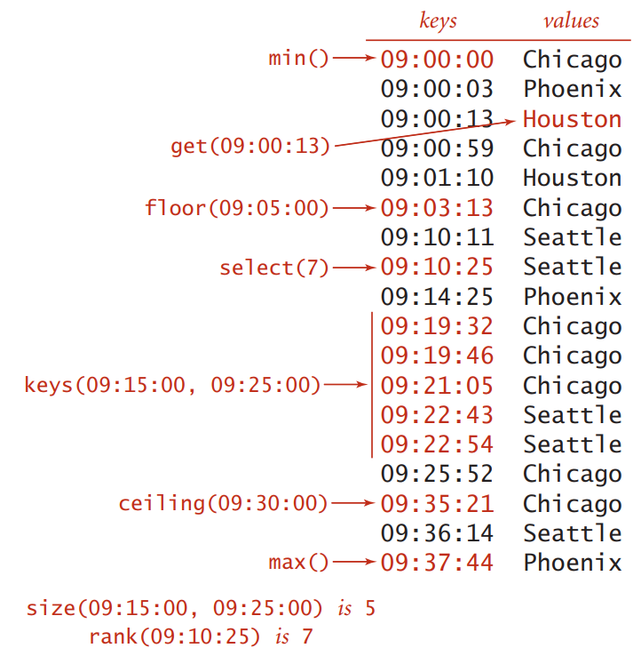

# Aula 04 - Implementação Busca

Do livro "Algorithms", Robert Sedgewick, página 366:

> Em aplicações típicas, as chaves são objetos **comparáveis**, então
> existe a opção de usar o código `a > b`, por exemplo, para comparar duas chaves `a` e `b`.
> Diversas implementações de tabela de símbolos aproveitam a ordem entre as chaves que são
> de estruturas Comparáveis para fornecer implementações eficientes das operações `put()` e `get()`. 
> Mais importante, em tais implementações, podemos pensar na tabela de símbolos como uma
> forma de manter as chaves em ordem e produzir uma API significativamente expandida que define
> numerosas operações naturais e úteis envolvendo a ordem de chaves armazenadas. Por exemplo,
> considere que suas chaves são horas do dia. Você pode estar interessado em conhecer a primeira
> ou a última hora armazenadas, o conjunto de chaves que caem entre dois momentos, e assim por diante. 
> Na maioria dos casos, essas operações não são difíceis de implementar com as mesmas estruturas de dados e
> métodos subjacentes às implementações `put()` e `get()`.

O objetivo deste exercício é implementar duas estruturas de dados:

* `t_time`: Estrutura para trabalhar com horas, minutos e segundos; e
* `t_timetable`: Tabela de símbolos eficiente para utilizar armazenar valores associados à chaves no formato `hora`

## Estrutura `t_time`

A estrutura hora deve armazenar valores para horas, minutos e segundos e possuir uma função
para comparar duas horas. Por exemplo:

```c
int time_cmp(t_time h1, t_time h2)

// Retorna:
// 1  se h1 >  h2
// 0  se h1 == h2
// -1 se h1 <  h2
```

## Estrutura `t_timetable`

A estrutura `t_timetable` deve ser uma tabela de símbolos eficiente, capaz de armazenar valores do tipo `char *` e chaves do tipo
`t_time`. Essa estrutura deve atender às seguintes operações:

| Retorno    | Operação                           | Descrição                                                          |
|-----------:|:----------------------------------:|--------------------------------------------------------------------|
| void       | `put(t_time key, char * val)`      | insere par key-value na tabela (remove elemento se valor for null) |
| char *     | `get(t_time key)`                  | valor armazenado com a chave key (null se key não existe)          |
| void       | `delete(t_time key)`               | remove chave e seu valor da tabela                                 |
| boolean    | `contains(t_time key)`             | existe um valor com a chave key?                                   |
| boolean    | `is_empty()`                       | a tabela está vazia?                                               |
| inte       | `size()`                           | número de pares key-value armazenados na tabela                    |
| t_time     | `min()`                            | menor chave armazenada                                             |
| t_time     | `max()`                            | maior chave armazenada                                             |
| t_time     | `floor(t_time key)`                | maior chave armazenada menor ou igual à key                        |
| t_time     | `ceiling(t_time key)`              | menor chave armazenada maior ou igual à key                        |
| int        | `rank(t_time key)`                 | número de chaves armazenadas menores do que key                    |
| t_time     | `select(int k)`                    | chave de rank igual a k                                            |
| void       | `delete_min()`                     | remove a menor chave                                               |
| void       | `delete_max()`                     | remove a maior chave                                               |
| int        | `size_range(t_time lo, t_time hi)` | número de chaves armazenadas entre `[lo..hi]`                      |
| t_time *   | `keys(t_time lo, t_time hi)`       | chaves armazenadas entre `[lo..hi]`                                |

## Exemplo



# Entrega

* Criar repositório no gitlab com o código;
* Enviar link do repositório como resposta na tarefa do moodle.

