# Árvores rubro-negras, árvores B e tries

[Slides desta aula (PDF)](09/00_rn_b_tries/rn_b_tries.pdf)

## Bibliografia recomendada para o tema

* SEDGEWICK, R.; WAYNE, K. **Algorithms**, 4th ed., seção 3.3 (*Balanced Search
  Trees*), inteira, e seção 5.2 (*Tries*);
* CORMEN, T. et al. **Introduction to Algorithms**, 3rd ed., cap. 13
  (*Red-Black Trees*) e cap. 18 (*B-Trees*);
* [algs4 - Balanced Search Trees](https://algs4.cs.princeton.edu/33balanced/) e
  [algs4 - Tries](https://algs4.cs.princeton.edu/52trie/);
* [Visualização interativa de árvores rubro-negras, B e tries (USF)](https://www.cs.usfca.edu/~galles/visualization/Algorithms.html),
  na seção *Trees*;
* [SQLite Database File Format, seção 1.6](https://www.sqlite.org/fileformat2.html#b_tree_pages),
  que descreve as páginas de árvore B usadas pelas tabelas e pelos índices.

## Objetivos da aula

Ao final desta aula você deve ser capaz de:

1. Enunciar as propriedades de uma árvore rubro-negra e verificar se uma árvore
   colorida dada as satisfaz;
2. Explicar por que essas propriedades limitam a altura a $2 \log_2(n+1)$;
3. Descrever a inserção em uma árvore rubro-negra em termos de recoloração e
   rotação, e dizer o que cada conserto corrige;
4. Comparar AVL e rubro-negra quanto à altura obtida e ao número de consertos
   por operação, e escolher entre as duas a partir do perfil de uso;
5. Explicar por que uma árvore binária é a estrutura errada para um índice em
   disco, e como a árvore B resolve o problema aumentando o número de filhos;
6. Executar à mão a inserção com divisão de nó em uma árvore B de ordem pequena;
7. Calcular quantos níveis uma árvore B precisa dado o número de chaves por nó;
8. Descrever a trie, dizer qual é o custo de busca nela e justificar por que
   esse custo não depende do número de chaves guardadas;
9. Escolher entre ABB balanceada, árvore B e trie a partir do tipo de chave e do
   meio em que a estrutura vive.

Este conteúdo cai na Prova 2.

## 1. Três estruturas e um mesmo problema

A aula de árvores binárias de busca e AVL terminou com a ABB balanceada
resolvendo busca, inserção e remoção em $O(\log n)$ no pior caso. Esta aula
mostra três estruturas que partem desse resultado e mudam alguma coisa nele:

* a **árvore rubro-negra** mantém a garantia da AVL com um critério de
  balanceamento mais frouxo, e é a estrutura de árvore mais usada em bibliotecas
  de linguagem;
* a **árvore B** abandona o formato binário para funcionar em disco, e é a
  estrutura de índice de bancos de dados e de sistemas de arquivos;
* a **trie** abandona a comparação entre chaves inteiras e usa a estrutura
  interna da chave, letra por letra.

### Demonstração: o índice de um banco de dados

O arquivo [09/demo/indice.sql](09/demo/indice.sql) cria uma tabela de dois
milhões de linhas no SQLite e consulta uma delas, antes e depois de criar um
índice:

```bash
cd 09/demo
sqlite3 aluno.db < indice.sql
```

```
Run Time: real 0.629     -- carga das 2 milhões de linhas
QUERY PLAN
`--SCAN aluno
aluno 1999999
Run Time: real 0.069     -- consulta sem índice

Run Time: real 0.430     -- CREATE INDEX idx_grr ON aluno(grr)
QUERY PLAN
`--SEARCH aluno USING INDEX idx_grr (grr=?)
aluno 1999999
Run Time: real 0.000     -- consulta com índice

4096                     -- PRAGMA page_size
```

O `EXPLAIN QUERY PLAN` mostra o que o banco decidiu fazer. Sem índice, ele lê a
tabela inteira, linha por linha, e o plano diz `SCAN`. Com índice, ele desce uma
estrutura de busca e o plano diz `SEARCH ... USING INDEX`. O tempo cai de 69 ms
para menos de 1 ms, e a diferença é a mesma de $\Theta(n)$ para $\Theta(\log n)$
que a árvore de busca já tinha dado sobre a lista.

Essa estrutura de busca é uma árvore B, e o número 4096 da última linha é o
tamanho em bytes de cada nó dela. A seção 8 explica de onde vem esse número, e a
seção 10 volta a esta demonstração.

## 2. O que o critério da AVL causa

A AVL exige que as alturas das duas subárvores de cada nó difiram em no máximo
1. É uma exigência difícil, e mantê-la tem dois custos:

* cada nó guarda um campo de altura, atualizado em todo nó do caminho a cada
  inserção ou remoção;
* a remoção pode exigir uma rotação em cada nível do caminho até a raiz, ou seja,
  até $O(\log n)$ rotações para tirar uma única chave.

A inserção é mais barata, com no máximo uma rotação simples ou dupla, mas é a
remoção que decide em uma estrutura que recebe alterações o tempo todo.

A pergunta que as árvores rubro-negras respondem é quanto desbalanceamento se
pode admitir sem perder a altura logarítmica. Elas foram propostas por Bayer em
1972, sob outro nome, e receberam a formulação com cores de Guibas e Sedgewick
em 1978.

## 3. As propriedades da árvore rubro-negra

Uma **árvore rubro-negra** é uma árvore binária de busca em que cada nó recebe
uma cor, vermelha ou preta, e que satisfaz:

1. a raiz é preta;
2. nenhum nó vermelho tem filho vermelho, ou seja, não há dois vermelhos
   seguidos em um caminho;
3. todo caminho da raiz até uma subárvore vazia contém o mesmo número de nós
   pretos.

O número da propriedade 3 é a **altura preta** da árvore. As subárvores vazias
contam como pretas, o que torna a propriedade verificável sem casos especiais.

Os desenhos desta aula seguem a convenção de Sedgewick: a cor de um nó é a cor
da **ligação** que vem do pai até ele, e a ligação vermelha aparece como um traço
grosso vermelho. Um nó vermelho, na definição acima, é um nó cuja ligação com o
pai é vermelha. A raiz não tem ligação acima dela, e conta como preta.

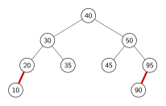

É a árvore que o `rn.go` da seção 5 constrói ao inserir
`50 30 90 20 40 95 10 35 45`. Os nós 10 e 90 são vermelhos, e todos os outros
são pretos. Todo caminho da raiz até uma subárvore vazia passa por três nós
pretos, e nenhum vermelho tem filho vermelho: não há duas ligações vermelhas
seguidas. A altura preta é 3, e a altura também é 3.

### Por que a altura é logarítmica

A propriedade 3 diz que todos os caminhos têm o mesmo número de nós pretos,
digamos $b$. A propriedade 2 diz que, entre dois pretos consecutivos de um
caminho, cabe no máximo um vermelho. O caminho mais longo possível, então,
alterna preto e vermelho, e tem no máximo $2b$ nós; o mais curto só tem pretos,
e tem $b$ nós.

Nenhum caminho passa de duas vezes o comprimento de outro. Como uma árvore em
que todos os caminhos têm ao menos $b$ nós pretos contém pelo menos $2^b - 1$
nós, vale $b \le \log_2(n+1)$, e a altura fica limitada por

$$h \le 2 \log_2(n + 1)$$

O limite é o dobro do da árvore perfeitamente balanceada, contra os 44% a mais
da AVL. Em compensação, chegar a uma árvore que satisfaça as três propriedades
custa menos consertos, e é isso que a seção 6 mostra.

## 4. A leitura como árvore 2-3

As cores parecem arbitrárias na formulação acima. Elas deixam de parecer quando
se olha a estrutura que elas codificam.

Uma **árvore 2-3** é uma árvore de busca em que um nó guarda uma ou duas chaves:
um nó com uma chave tem dois filhos, e um nó com duas chaves tem três filhos,
com as chaves das subárvores caindo nas três faixas que as duas chaves do nó
determinam. Todas as folhas ficam no mesmo nível, o que dá altura logarítmica
por construção.

Uma árvore 2-3 vira uma árvore binária colorida com uma regra: o nó de duas
chaves é desenhado como dois nós binários ligados por uma ligação **vermelha**.

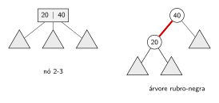

Com essa leitura, as ligações pretas são as que descem de um nível da árvore 2-3
para o seguinte, e a altura preta é exatamente a altura da árvore 2-3. A árvore
da seção 3, lida assim, é uma árvore 2-3 de três níveis e sete nós: `[10 20]` e
`[90 95]` têm duas chaves, e os outros cinco nós têm uma.

Nesta aula usamos a variante **left-leaning** de Sedgewick (*left-leaning
red-black tree*, LLRB), que acrescenta duas exigências às três da seção 3:

* toda ligação vermelha aponta para a esquerda;
* nenhum nó tem duas ligações vermelhas, nem para os dois filhos, nem uma de
  cima e uma de baixo.

Com elas, cada nó 2-3 tem uma única representação binária, e a correspondência
com a árvore 2-3 é exata. A formulação do Cormen não faz essas exigências: ela
admite ligação vermelha à direita e admite um nó preto com os dois filhos
vermelhos, que corresponde a um nó com três chaves. Pela definição do Cormen, as
cores codificam uma árvore 2-3-4, e não uma árvore 2-3.

Há, portanto, duas versões de árvore rubro-negra em uso: a do Cormen, que é a
das bibliotecas, e a left-leaning de Sedgewick, que é a desta aula. As duas
satisfazem as três propriedades da seção 3 e têm o mesmo limite de altura. Elas
diferem no número de rotações por operação: a do Cormen faz no máximo 2 por
inserção e 3 por remoção, e a left-leaning pode fazer até $O(\log n)$ em cada
uma, em troca de um código bem mais curto. A seção 6 volta a essa diferença.

As restrições a mais eliminam metade dos casos da inserção e são a razão de o
código da seção 5 caber em poucas linhas. A árvore da seção 3 é left-leaning.

### Inserção na árvore 2-3

A inserção na árvore 2-3 é a mesma que a seção 9 descreve para a árvore B, com
ordem 3: a chave nova entra sempre em uma folha, e um nó que fica com chaves
demais se divide. As figuras inserem 20, 30, 40, 50, 60, 70 e 80, nessa ordem, a
sequência que degenera a ABB em uma lista.

Se a folha tem uma chave, a nova entra ao lado dela e o nó passa a ter duas.

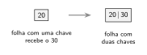

Se a folha já tem duas chaves, ela fica por um momento com três chaves e quatro
filhos, um nó que a árvore 2-3 não admite e que a árvore 2-3-4 admite. O nó
temporário se divide em seguida: a chave do meio sobe para o pai, e as outras
duas ficam em dois nós de uma chave. Quando a folha é a raiz, a chave do meio
vira uma raiz nova, e a árvore ganha um nível.

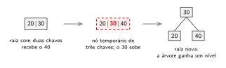

Quando o pai tem uma chave, ele recebe a que subiu e fica com duas.

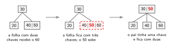

Quando o pai também tem duas chaves, ele fica com três e se divide do mesmo
jeito, e a divisão pode subir até a raiz. Na figura, a inserção do 70 já
completou a folha do 60.

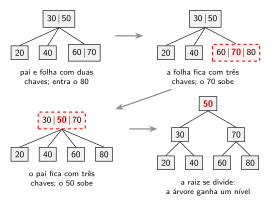

Como na árvore B, a árvore 2-3 cresce pela raiz, e por isso todas as folhas
ficam no mesmo nível. Na rubro-negra, depois das rotações, o nó temporário é o
nó com duas ligações vermelhas para os filhos, e a divisão dele é a inversão de
cores da seção 5.

## 5. Inserção: um nó novo vermelho e três consertos

O nó novo entra sempre **vermelho**. Se entrasse preto, ele acrescentaria um nó
preto ao caminho que o contém e quebraria a propriedade 3 de imediato, que é a
mais cara de restabelecer. Entrando vermelho, ele pode quebrar apenas a
propriedade 2, e só quando o pai também for vermelho.

Os consertos são três, aplicados nessa ordem na volta da recursão, em cada nó do
caminho da folha nova até a raiz:

| Situação no nó | Conserto | O que muda |
|---|---|---|
| filho direito vermelho e esquerdo preto | rotação à esquerda | ponteiros |
| filho esquerdo vermelho com filho esquerdo vermelho | rotação à direita | ponteiros |
| os dois filhos vermelhos | inversão de cores | só as cores |

A inversão de cores pinta os dois filhos de preto e o pai de vermelho. Ela
empurra o vermelho um nível para cima, e é o que faz a informação de
desbalanceamento subir até um ponto em que uma rotação resolva. Em uma árvore
2-3, é a divisão de um nó que ficou com três chaves.

```go
func insere(a *No, v int) *No {
    if a == nil {
        return &No{Info: v, Cor: Vermelho}
    }

    if v < a.Info {
        a.Esq = insere(a.Esq, v)
    } else if v > a.Info {
        a.Dir = insere(a.Dir, v)
    }

    if vermelho(a.Dir) && !vermelho(a.Esq) {
        a = rotacionaEsquerda(a)
    }
    if vermelho(a.Esq) && vermelho(a.Esq.Esq) {
        a = rotacionaDireita(a)
    }
    if vermelho(a.Esq) && vermelho(a.Dir) {
        inverteCores(a)
    }

    return a
}
```

A rotação é a mesma da AVL, com uma linha a mais: a cor acompanha o nó que sobe,
e o nó que desce fica vermelho.

```go
func rotacionaEsquerda(a *No) *No {
    b := a.Dir
    a.Dir = b.Esq
    b.Esq = a
    b.Cor = a.Cor
    a.Cor = Vermelho
    return b
}
```

Quem chama `Insere` pinta a raiz de preto ao final, o que restabelece a
propriedade 1 sem tocar em mais nada: pintar a raiz de preto acrescenta um nó
preto a todos os caminhos ao mesmo tempo.

A busca não muda em nada em relação à ABB. As cores não participam da
comparação, e um programa que só consulte a árvore não precisa nem saber que
elas existem.

O código segue o `RedBlackBST.java` de Sedgewick linha a linha, sem o campo de
tamanho da subárvore e sem o valor associado à chave. Uma diferença: lá a
inversão de cores troca cada cor pela oposta, porque a mesma função serve à
remoção; na inserção, as duas versões dão o mesmo resultado.

As figuras abaixo mostram os consertos em ação, com os exemplos que Sedgewick e
Wayne usam na seção 3.3. Na primeira, a inserção de P aplica os três consertos,
um deles duas vezes: inversão de cores no M, rotação à esquerda no E, rotação à
direita no R e nova inversão de cores no M, que chegou à raiz. Cada painel
mostra a árvore depois de um conserto, com o nó em que ele foi aplicado em
laranja.

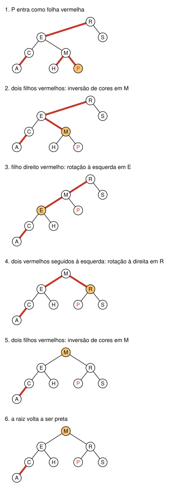

Na segunda, as chaves `S E A R C H X M P L` entram uma a uma, de cima para baixo,
primeiro na coluna da esquerda. A chave recém-inserida tem a letra em vermelho, e
os nós em cinza são os que ficam fora do caminho percorrido pela inserção.

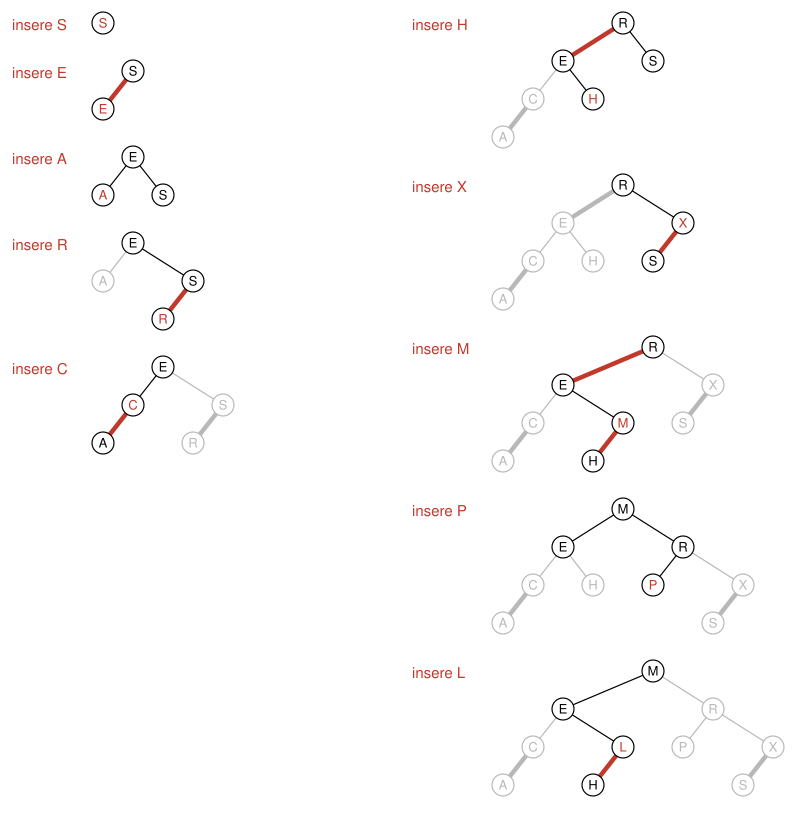

As figuras desta seção são geradas pelo [09/img/gera_rn.go](09/img/gera_rn.go),
que usa a mesma inserção do `rn.go`.

O código completo, com a verificação das três propriedades, está em
[09/codes/rn.go](09/codes/rn.go):

```bash
cd 09/codes
go run rn.go
```

```
Inserindo [50 30 90 20 40 95 10 35 45]

        95 (p)
            90 (v)
    50 (p)
        45 (p)
40 (p)
        35 (p)
    30 (p)
        20 (p)
            10 (v)

in-ordem: 10 20 30 35 40 45 50 90 95 
altura: 3   altura preta: 3   é rubro-negra: true
```

A árvore está deitada, com a raiz à esquerda e a subárvore direita em cima, e é
a mesma do desenho da seção 3. O `(v)` marca o nó cuja ligação com o pai é
vermelha, e o `(p)`, o nó cuja ligação é preta. Observe que a raiz é o 40, e não o 50 que foi inserido primeiro: as rotações
mudaram quem ocupa a raiz, como já acontecia na AVL.

As três figuras seguintes, no formato das que Sedgewick usa, mostram árvores
rubro-negras left-leaning com 255 chaves, inseridas em ordem crescente, em ordem
decrescente e em ordem aleatória. As ligações vermelhas aparecem em vermelho. No
canto de cada figura, `níveis` é a altura mais um, na contagem do `rn.go`,
`média` é o número médio de nós visitados em uma busca e `ótimo` é esse número
médio na árvore perfeitamente balanceada.

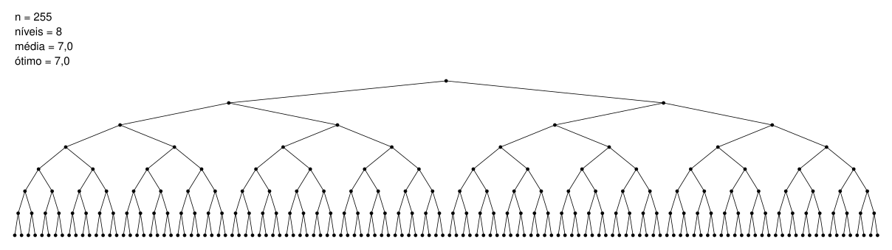


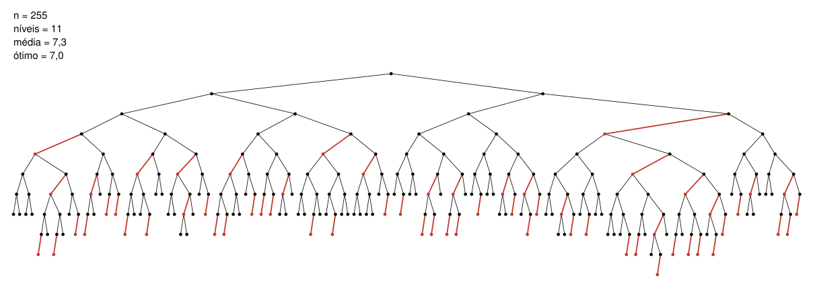

As ordens crescente e decrescente, que degeneram a ABB em uma lista, produzem aqui
a árvore perfeitamente balanceada, sem nenhuma ligação vermelha. A ordem
aleatória produz uma árvore de 11 níveis, 3 a mais que o ótimo, e a busca média
visita 7,3 nós, contra 7,0. A figura da ordem aleatória também é gerada pelo
`gera_rn.go`, e outra ordem aleatória dá outra árvore.

## 6. AVL e rubro-negra medidas lado a lado

O programa [09/codes/comparacao.go](09/codes/comparacao.go) insere a mesma
sequência nas três estruturas e conta os consertos:

```bash
go run comparacao.go
```

```
Inserções em ordem crescente

       n | alt. ABB | alt. AVL | alt. RN | rot. AVL | rot. RN | recolor. RN
---------+----------+----------+---------+----------+---------+------------
    1000 |      999 |        9 |       9 |      990 |     991 |         985
   10000 |     9999 |       13 |      13 |     9986 |    9987 |        9982
  100000 |    99999 |       16 |      16 |    99983 |   99984 |       99978

Inserções em ordem aleatória

       n | alt. ABB | alt. AVL | alt. RN | rot. AVL | rot. RN | recolor. RN
---------+----------+----------+---------+----------+---------+------------
    1000 |       19 |       11 |      13 |      718 |    1204 |         747
   10000 |       31 |       15 |      17 |     7027 |   11970 |        7489
  100000 |       40 |       19 |      22 |    69951 |  118478 |       74636
```

Três leituras da tabela:

* as duas estruturas balanceadas eliminam a degeneração, e as alturas ficam
  longe dos limites teóricos, que para $n = 100$ mil são 24 para a AVL e 34 para
  a rubro-negra;
* a AVL fica mais baixa que a rubro-negra em todas as linhas, por 2 ou 3 níveis
  na ordem aleatória. Cada nível a mais é uma comparação a mais por busca;
* na inserção, a rubro-negra **não** faz menos rotações. Na variante
  left-leaning medida aqui ela faz mais, porque também mantém as arestas
  vermelhas todas à esquerda, e ainda recolore em cerca de três quartos das
  inserções.

A vantagem da rubro-negra aparece na **remoção**, que não está medida nessa
tabela, e só na versão do Cormen. A remoção nessa versão faz no máximo 3
rotações, contra até $O(\log n)$ na AVL, porque o conserto da AVL pode reduzir a
altura da subárvore e propagar o desbalanceamento para o pai a cada nível. A
left-leaning não tem esse limite: a remoção dela pode rotacionar em cada nível do
caminho, como a AVL. Uma estrutura com muitas remoções paga menos na rubro-negra
do Cormen; uma estrutura quase só de buscas aproveita a árvore mais baixa da AVL.

| | AVL | Rubro-negra (Cormen) | Rubro-negra (left-leaning) |
|---|---|---|---|
| Altura no pior caso | $1{,}44 \log_2(n+2)$ | $2 \log_2(n+1)$ | $2 \log_2(n+1)$ |
| Rotações por inserção | no máximo 2 | no máximo 2 | até $O(\log n)$ |
| Rotações por remoção | até $O(\log n)$ | no máximo 3 | até $O(\log n)$ |
| Informação por nó | altura (um inteiro) ou fator (2 bits) | cor (um bit) | cor (um bit) |
| Uso típico | muitas buscas, poucas alterações | uso geral, bibliotecas | ensino, implementações curtas |

As implementações usuais de `std::map` em C++, o `TreeMap` do Java e a
implementação de árvore rubro-negra do kernel do Linux, em `lib/rbtree.c`, usam
a versão do Cormen. O `map` de Go não entra na lista: ele é uma tabela de dispersão,
que é o assunto da próxima aula.

### Por que as bibliotecas escolhem a rubro-negra

A tabela acima não mostra uma vitória clara da rubro-negra, e a preferência das
bibliotecas se explica por fatores diferentes.

O primeiro é o número de mudanças na estrutura por operação. A rubro-negra do
Cormen faz no máximo 2 rotações por inserção e 3 por remoção, qualquer que seja o tamanho
da árvore. Contar rotações parece detalhe, e deixa de ser quando cada rotação
custa mais que três atribuições de ponteiro:

* em uma **árvore aumentada**, em que cada nó guarda um valor calculado a partir
  da subárvore (o tamanho dela, o maior extremo de um intervalo), cada rotação
  obriga a recalcular esse valor nos nós que mudaram de lugar. O kernel do Linux
  oferece essa variante sobre a mesma `lib/rbtree.c`;
* em uma **estrutura persistente**, que preserva as versões anteriores, cada nó
  alterado é copiado;
* em uma estrutura acessada por várias *threads*, cada rotação é um trecho que
  precisa de sincronização.

O segundo é que uma biblioteca de uso geral não sabe como vai ser usada. Quem
escreve o `TreeMap` do Java não conhece a proporção entre buscas e alterações do
programa que vai usá-lo. A rubro-negra tem um pior caso aceitável nos dois
lados; a AVL ganha na busca e paga mais na alteração.

O terceiro é histórico. A biblioteca padrão de C++ herdou a rubro-negra da STL
desenvolvida na HP e na SGI nos anos 1990, o Cormen a apresenta como a árvore
balanceada de referência, e as bibliotecas posteriores seguiram o mesmo caminho.
Parte da preferência vem dessa tradição, e não de uma medição refeita em cada
caso.

A diferença prática entre as duas é pequena. Em aplicações dominadas por buscas,
a AVL, mais baixa, costuma ser a mais rápida, e há sistemas que a usam, como as
tabelas genéricas do kernel do Windows. 

O argumento da memória também é fraco: a
cor cabe em um bit, que o Linux guarda no bit menos significativo do ponteiro
para o pai, mas o fator de balanceamento da AVL cabe em dois.

Por fim, a tabela medida no início desta seção é da variante left-leaning, que
faz mais rotações que a versão do Cormen, usada nas bibliotecas. Ela exagera,
portanto, o custo de inserção da rubro-negra.

## 7. Aprofundamento: a remoção na rubro-negra

A remoção é o ponto em que a rubro-negra do Cormen ganha da AVL e, por ironia, é também a
parte mais trabalhosa de escrever. A dificuldade é que remover um nó preto
diminui em um a altura preta de um dos lados, e restabelecer a propriedade 3
exige empurrar o "preto faltando" para cima até encontrar um irmão vermelho de
onde tirar a diferença.

Esta aula não desenvolve a remoção, e ela não cai na Prova 2 além do fato
enunciado na seção 6, o de que ela faz no máximo 3 rotações na versão do
Cormen. Quem quiser ver o
algoritmo inteiro encontra a versão do Cormen no capítulo 13, seção 13.4, e a
versão left-leaning em Sedgewick, seção 3.3. O site do livro traz o
[texto da seção 3.3](https://algs4.cs.princeton.edu/33balanced/) e o código
completo da left-leaning em
[RedBlackBST.java](https://algs4.cs.princeton.edu/33balanced/RedBlackBST.java.html),
com a remoção nos métodos `delete`, `moveRedLeft` e `moveRedRight`.

## 8. Quando a árvore binária é a estrutura errada

Todas as estruturas até aqui supõem que descer um nível custa o mesmo que
qualquer outra operação. Em memória principal isso é razoável. Em disco, não.

Um índice de banco de dados com 100 milhões de chaves não cabe na memória e vive
em disco. Uma árvore rubro-negra com 100 milhões de nós tem altura por volta de
40, e cada nível visitado é um nó em um endereço qualquer do arquivo. Em um disco
rotacional, cada leitura dessas custa alguns milissegundos, e 40 delas passam de
100 ms para achar uma chave. Em um SSD o número é menor, e ainda assim a leitura
é da ordem de dezenas de microssegundos, contra nanossegundos de um acesso à
memória.

A leitura em disco tem outra característica: o sistema operacional não lê um
byte nem 16 bytes, lê uma **página** inteira, tipicamente de 4096 bytes. Ler 16
bytes e ler 4096 bytes custa quase o mesmo. Uma árvore binária usa 16 dos 4096
bytes que a leitura trouxe e joga fora o resto.

A saída é montar o nó do tamanho da página. Se cada chave com o ponteiro
associado ocupa 20 bytes, um nó de 4096 bytes guarda cerca de 200 chaves e tem
cerca de 201 filhos. A árvore deixa de ser binária, e a altura despenca:

```
  ordem | chaves/nó |   1 mil |   1 mi | 1 bilhão
--------+-----------+---------+--------+---------
      5 |         4 |       5 |      9 |       13
    101 |       100 |       2 |      3 |        5
    201 |       200 |       2 |      3 |        4
   1001 |      1000 |       1 |      2 |        3
```

A tabela, produzida pelo `btree.go` da próxima seção, dá o número de níveis com
os nós cheios. Com 200 chaves por nó, um bilhão de chaves cabe em 4 níveis, ou
seja, 4 leituras de disco por busca.

## 9. Árvores B

Uma **árvore B de ordem $m$** é uma árvore de busca em que:

* cada nó guarda no máximo $m - 1$ chaves, em ordem crescente, e no máximo $m$
  filhos;
* as chaves de um nó dividem as chaves das subárvores em faixas: tudo o que é
  menor que a primeira chave fica no primeiro filho, o que está entre a primeira
  e a segunda fica no segundo filho, e assim por diante;
* todo nó, exceto a raiz, guarda no mínimo $\lceil m/2 \rceil - 1$ chaves, o que
  garante que os nós fiquem ao menos meio cheios;
* todas as folhas estão no mesmo nível.

A última condição é o critério de balanceamento, e ele é mais forte que o da AVL:
não há caminho mais longo que outro. Manter isso é possível porque o nó tem folga
de tamanho, e uma chave nova pode entrar em um nó existente sem criar nível novo.

### Busca

A busca desce um nível por vez. Dentro de cada nó, procura-se a chave entre as
$m-1$ do nó, o que decide por qual dos $m$ filhos continuar:

```go
func Busca(n *NoB, v int) bool {
    if n == nil {
        return false
    }
    i, achou := posicao(n, v)
    if achou {
        return true
    }
    if ehFolha(n) {
        return false
    }
    return Busca(n.Filhos[i], v)
}
```

A busca dentro do nó é sequencial no código acima, e poderia ser binária. A
diferença não importa em disco, porque as duas acontecem dentro da mesma página
já lida, e o custo que domina é o das leituras.

### Inserção e divisão

A inserção sempre acontece em uma folha, achada como na busca. Se a folha tiver
espaço, a chave entra e acabou. Se ela estourar o limite de $m-1$ chaves, o nó se
**divide**: a chave do meio sobe para o pai, e as chaves à esquerda e à direita
dela ficam em dois nós.

```go
func divide(n *NoB) (int, *NoB) {
    meio := len(n.Chaves) / 2
    subiu := n.Chaves[meio]

    direito := &NoB{Chaves: append([]int{}, n.Chaves[meio+1:]...)}
    if !ehFolha(n) {
        direito.Filhos = append([]*NoB{}, n.Filhos[meio+1:]...)
        n.Filhos = n.Filhos[:meio+1]
    }
    n.Chaves = n.Chaves[:meio]

    return subiu, direito
}
```

A chave que sobe pode estourar o pai, que se divide também, e a divisão pode
propagar até a raiz. Quando a **raiz** se divide, a árvore ganha um nível, e esse
é o único jeito de uma árvore B crescer em altura. Por isso ela cresce pela raiz,
e não pelas folhas, e por isso todas as folhas continuam no mesmo nível.

As duas figuras mostram inserções do exemplo a seguir, com a chave que sobe em
vermelho. Na primeira, a inserção do 5 estoura a única folha, que também é a
raiz, e a árvore ganha o primeiro nível. Na segunda, a inserção do 17 divide uma
folha, a chave 15 sobe e estoura a raiz, e a divisão da raiz cria um nível novo.

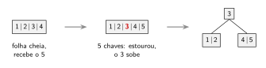

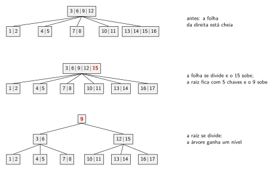

O programa [09/codes/btree.go](09/codes/btree.go) insere 1 a 20 em uma árvore de
ordem 5:

```bash
go run btree.go
```

```
Árvore B de ordem 5: até 4 chaves e 5 filhos por nó

inserção do  5: a raiz se dividiu, altura agora é 1
inserção do 17: a raiz se dividiu, altura agora é 2

Árvore depois de inserir 1 a 20 em ordem crescente:
[9]
    [3 6]
        [1 2]
        [4 5]
        [7 8]
    [12 15 18]
        [10 11]
        [13 14]
        [16 17]
        [19 20]
```

A entrada está em ordem crescente, a mesma que degenera a ABB em uma lista, e a
árvore B saiu com 3 níveis e todas as folhas no último. Uma ABB com as mesmas 20
chaves nessa ordem teria altura 19, como o `forma.go` do material de árvores
binárias de busca mostra para outros tamanhos.

### B+ e o que os sistemas reais usam

A variante mais comum na prática é a **árvore B+**, em que todas as chaves ficam
nas folhas, os nós internos guardam apenas separadores, e as folhas são ligadas
em lista encadeada. As duas mudanças servem à consulta por faixa: achada a chave
inicial, o restante do intervalo sai seguindo os ponteiros entre folhas, sem
subir e descer a árvore.

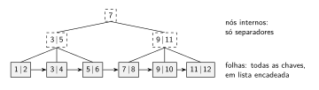

Na figura, os nós tracejados são os internos, que guardam só cópias de chaves
usadas como separadores. Uma consulta pelas chaves de 4 a 9 desce até a folha
`3 4` e segue as setas até a folha `9 10`, sem voltar aos nós internos.

A última consulta do `indice.sql` mostra isso acontecendo:

```sql
EXPLAIN QUERY PLAN SELECT count(*) FROM aluno WHERE grr BETWEEN 1000 AND 2000;
```

```
`--SEARCH aluno USING COVERING INDEX idx_grr (grr>? AND grr<?)
```

O `BETWEEN` é atendido pelo índice, e não por uma varredura. A documentação do
formato de arquivo do SQLite diz que as tabelas são árvores B+ e os índices são
árvores B, com o tamanho de página de 4096 bytes que a demonstração imprimiu.
PostgreSQL, MySQL/InnoDB, sistemas de arquivos como o Btrfs e o XFS usam a mesma
família de estruturas.

## 10. De volta à demonstração

A demonstração da seção 1 pode ser relida com os termos desta aula. A tabela sem
índice obriga o banco a ler todas as páginas do arquivo, uma por vez, e comparar
cada linha: é o `SCAN`, e custa $\Theta(n)$ leituras. O `CREATE INDEX` constrói
uma árvore B sobre a coluna `grr`, e a consulta passa a descer essa árvore: é o
`SEARCH USING INDEX`, e custa a altura da árvore, que para 2 milhões de chaves
fica em 3 níveis. O `PRAGMA page_size` mostrou 4096, que é o tamanho do nó.

Os 0,430 s gastos no `CREATE INDEX` também ganham explicação: são 2 milhões de
inserções em árvore B, com as divisões de nó que elas provocam. O índice acelera
a consulta e custa tempo na escrita, e é por isso que nenhum banco indexa todas
as colunas por conta própria.

## 11. Tries

As três estruturas anteriores comparam chaves inteiras. Quando a chave é uma
palavra, cada comparação percorre a palavra até achar a primeira letra diferente,
e a árvore de altura $\log n$ faz $\log n$ dessas comparações.

A **trie**, nome tirado de re**trie**val, muda a pergunta: em vez de comparar a chave com a do
nó, usa uma letra da chave para escolher o filho. A chave não fica guardada em
nenhum nó. Ela é o caminho da raiz até o nó, uma letra por aresta, e um marcador
diz quais caminhos correspondem a palavras inteiras.

```
       (raiz)
       /    \
      c      d
      |      |
      a      a
     / \     |
    s   r    d
    |   |    |
   [a]  t   [o]
    |   |
   [l] [a]
        |
       [z]
```

Um nó entre colchetes marca fim de palavra. A trie do desenho guarda `casa`,
`casal`, `carta`, `cartaz` e `dado`, em 13 nós além da raiz. Os prefixos comuns
são guardados uma vez só, e é daí que vem a economia de espaço quando as chaves
se parecem.

```go
type No struct {
    Filhos       map[rune]*No
    FimDePalavra bool
}

func Insere(raiz *No, palavra string) {
    atual := raiz
    for _, letra := range palavra {
        proximo, existe := atual.Filhos[letra]
        if !existe {
            proximo = NovoNo()
            atual.Filhos[letra] = proximo
        }
        atual = proximo
    }
    atual.FimDePalavra = true
}
```

A busca é o mesmo percurso, sem criar nós, e responde `true` quando o caminho
existe **e** o nó final está marcado. A distinção entre as duas condições é o que
separa "a palavra está na trie" de "alguma palavra da trie começa assim".

### O custo não depende do número de chaves

Buscar uma palavra de $m$ letras custa $O(m)$ passos, independentemente de a trie
guardar mil ou dez milhões de palavras. Em uma ABB balanceada com $n$ palavras
seriam $O(m \log n)$ no pior caso, contando o custo de cada comparação entre
palavras.

Em troca, a trie ocupa mais espaço: cada nó carrega a estrutura de filhos, e o
número de nós é da ordem do número de letras distintas dos prefixos. O
[09/codes/trie.go](09/codes/trie.go) mede isso em um exemplo pequeno:

```bash
go run trie.go
```

```
17 palavras, 86 letras no total, 37 nós na trie

Contem("casa") = true, EhPrefixo("casa") = true
Contem("cas") = false, EhPrefixo("cas") = true
Contem("cartão") = true, EhPrefixo("cartão") = true
Contem("carroça") = false, EhPrefixo("carroça") = false

ComPrefixo("car") = carro, carta, cartaz, cartão
ComPrefixo("cas") = casa, casaco, casal, caso, cassino
ComPrefixo("gra") = grade, grafo, grafos, grau
ComPrefixo("z") = nenhuma palavra
```

Os prefixos compartilhados reduziram 86 letras a 37 nós. A implementação usa um
`map[rune]*No` por nó, que gasta pouco espaço quando o nó tem poucos filhos. A
alternativa clássica é um vetor de tamanho fixo, com uma posição por letra do
alfabeto, que dá acesso em tempo constante e desperdiça as posições não usadas.

A figura mostra a trie das 17 palavras do `trie.go`, com os 37 nós além da raiz.
Os nós em cinza marcam fim de palavra.

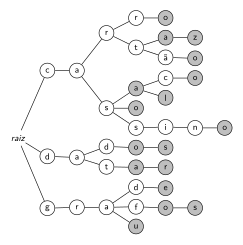

### Consulta por prefixo

`ComPrefixo` desce até o nó do prefixo e coleta a subárvore inteira. O custo é o
comprimento do prefixo mais o número de palavras devolvidas, e nenhuma palavra
fora da resposta é visitada.

É a operação que sustenta autocompletar de campo de busca, corretor ortográfico e
roteamento IP, em que o roteador procura a entrada da tabela com o prefixo mais
longo que casa com o endereço de destino. Nenhuma tabela de dispersão faz isso: o
hash espalha as chaves justamente para destruir a vizinhança entre chaves
parecidas, como veremos na próxima aula.

## 12. Escolher entre as estruturas

| Estrutura | Busca | Escolha quando |
|---|---|---|
| ABB sem balanceamento | $O(h)$, degenera | nunca em código de produção |
| AVL | $\Theta(\log n)$ | busca domina, alterações são raras |
| Rubro-negra | $\Theta(\log n)$ | uso geral, muitas inserções e remoções |
| Árvore B / B+ | $\Theta(\log_m n)$ leituras | a estrutura vive em disco ou em página |
| Trie | $O(m)$ | chaves são cadeias e a consulta por prefixo importa |

O critério das três primeiras linhas é a proporção entre buscas e alterações. O
da quarta é o meio em que a estrutura vive, e não o número de chaves. O da quinta
é o tipo da chave.

## 13. Exercícios

**Estes exercícios não valem nota** e não têm entrega. O conteúdo cai na Prova 2.
Resolva antes da próxima aula.

**1.** A árvore abaixo satisfaz as três propriedades da seção 3? Se não, diga
qual delas falha e em que caminho. Ela é left-leaning?

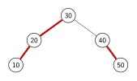

**2.** Dê o menor número de nós de uma árvore rubro-negra de altura preta 3, e o
maior. Desenhe as duas árvores.

**3.** Insira, em uma árvore rubro-negra vazia e na variante left-leaning, os
valores `10 20 30 40 50`, um a um, desenhando a árvore e as cores depois de cada
inserção e nomeando o conserto aplicado. Confira com `go run rn.go`, alterando a
lista de valores no `main`.

**4.** Uma árvore rubro-negra com 31 nós pode ter altura 8? E altura 3? Justifique
com os limites da seção 3, sem desenhar árvore nenhuma.

**5.** A inserção da seção 5 pinta a raiz de preto ao final de toda inserção.
Explique por que essa operação nunca quebra a propriedade 3, e o que aconteceria
com a altura preta se ela fosse aplicada a um nó qualquer que não a raiz.

**6.** Insira `1 2 3 ... 12` em uma árvore B de ordem 3, à mão, desenhando a
árvore depois de cada divisão de nó. Confira com o `btree.go`, alterando a
constante `ordem`.

**7.** Um índice guarda 50 milhões de chaves. Cada chave com o ponteiro associado
ocupa 24 bytes, e a página tem 4096 bytes. Quantas chaves cabem em um nó, e
quantos níveis a árvore B tem com os nós cheios? Refaça a conta supondo os nós
com metade da ocupação, que é o mínimo garantido pela definição.

**8.** Escreva `Altura(n *NoB) int` sem descer sempre pelo primeiro filho, e
explique por que a versão do `btree.go`, que desce só por um caminho, está
correta.

**9.** Escreva `Minimo(n *NoB) (int, bool)` e `Maximo(n *NoB) (int, bool)` para a
árvore B, e diga quantos nós cada uma visita.

**10.** Acrescente ao `trie.go` a função `Remove(raiz *No, palavra string)`, que
desmarca o fim de palavra e apaga os nós que deixaram de fazer parte de qualquer
palavra. Teste removendo `casa` de uma trie que também contém `casal`, e depois
removendo `cassino`.

**11.** Escreva `MaiorPrefixoComum(raiz *No) string`, que devolve o maior prefixo
compartilhado por todas as palavras da trie. Qual é o custo da sua função?

**12.** A trie do `trie.go` usa `map[rune]*No`. Reescreva o nó com um vetor de 26
posições, aceitando apenas letras de `a` a `z` (troque `cartão` por `cartao` na
lista de palavras), e compare o número de posições alocadas com o número de
filhos de fato usados.

### Desafio

Uma trie em que muitos nós têm um filho só desperdiça espaço com cadeias de nós
sem ramificação. A **trie compacta**, ou árvore radix, junta cada cadeia dessas
em um nó único que guarda o trecho inteiro da palavra. Implemente a busca e a
inserção em uma trie compacta, e conte quantos nós ela usa nas 17 palavras do
`trie.go`. A inserção é o caso interessante: inserir `carta` em uma trie que já
tem `cartaz` obriga a quebrar um nó existente em dois.

---

## Resumo

* Uma árvore rubro-negra é uma ABB colorida com raiz preta, sem dois vermelhos
  seguidos, e com o mesmo número de nós pretos em todo caminho da raiz até uma
  subárvore vazia. As três propriedades limitam a altura a $2\log_2(n+1)$.
* Há duas versões: a do Cormen, usada nas bibliotecas, e a left-leaning de
  Sedgewick, usada nesta aula. Na left-leaning, as cores codificam uma árvore
  2-3: a aresta vermelha liga as duas metades de um nó de duas chaves, e a altura
  preta é a altura da árvore 2-3. Na do Cormen, codificam uma árvore 2-3-4.
* O nó novo entra vermelho e os consertos são rotação à esquerda, rotação à
  direita e inversão de cores, aplicados na volta da recursão. A busca é a mesma
  da ABB.
* A AVL fica 2 ou 3 níveis mais baixa que a rubro-negra, e a rubro-negra do
  Cormen faz no máximo 3 rotações por remoção, contra até $O(\log n)$ da AVL. A escolha entre as
  duas é a proporção entre buscas e alterações.
* Em disco, o custo é o número de páginas lidas, e a árvore binária desperdiça a
  página inteira em cada leitura. A árvore B faz o nó do tamanho da página, o que
  dá centenas de filhos por nó e 3 ou 4 níveis para bilhões de chaves.
* A árvore B insere sempre em folha e cresce pela raiz, dividindo os nós cheios.
  Todas as folhas ficam no mesmo nível. A variante B+ guarda as chaves só nas
  folhas e as encadeia, o que atende consulta por faixa.
* A trie usa uma letra da chave por nível, guarda a chave no caminho e não no nó,
  e busca em $O(m)$, sem depender do número de chaves. É a estrutura que responde
  consulta por prefixo visitando apenas a resposta.
