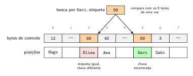

# Tabelas de dispersão

[Slides desta aula (PDF)](10/00_hash/hash.pdf)

## Bibliografia recomendada para o tema

* SEDGEWICK, R.; WAYNE, K. **Algorithms**, 4th ed., seção 3.4 (*Hash Tables*),
  inteira;
* CORMEN, T. et al. **Introduction to Algorithms**, 3rd ed., cap. 11 (*Hash
  Tables*), seções 11.1 a 11.4;
* [algs4 - Hash Tables](https://algs4.cs.princeton.edu/34hash/);
* visualizações interativas da USF para
  [encadeamento](https://www.cs.usfca.edu/~galles/visualization/OpenHash.html)
  e para
  [endereçamento aberto](https://www.cs.usfca.edu/~galles/visualization/ClosedHash.html),
  úteis para conferir à mão os exercícios;
* [Faster Go maps with Swiss Tables](https://go.dev/blog/swisstable), texto do
  blog oficial de Go que descreve a implementação atual do `map`.

## Objetivos da aula

Ao final desta aula você deve ser capaz de:

1. Explicar como uma tabela de dispersão transforma a chave em uma posição de
   vetor, e por que a busca nela não depende do número de chaves no caso médio;
2. Avaliar uma função de dispersão quanto à distribuição das chaves, e explicar
   por que o tamanho da tabela costuma ser primo na dispersão modular;
3. Executar à mão a inserção com encadeamento e com as três regras de
   endereçamento aberto: sondagem linear, sondagem quadrática e dispersão
   dupla;
4. Relacionar o fator de carga ao custo médio da busca, e explicar quando e por
   que a tabela é redimensionada;
5. Explicar por que a remoção em endereçamento aberto exige lápide;
6. Descrever o filtro de Bloom e o tipo de erro que ele admite;
7. Escolher entre tabela de dispersão e árvore de busca a partir das operações
   que a aplicação precisa.

Este conteúdo cai na Prova 2.

## 1. Uma estrutura sem ordem

A aula de árvores rubro-negras, árvores B e tries terminou com uma observação: o
`map` de Go não é uma árvore. A demonstração desta aula mostra duas
características dele que nenhuma árvore de busca tem.

### Demonstração: o `map` de Go

O programa `mapa.go` ([ver no GitHub](https://github.com/tads-ufpr-alexkutzke/ds143-material/blob/main/src/10/demo/mapa.go)) percorre o mesmo `map` três
vezes e depois mede o tempo de uma busca em três estruturas, com tamanhos
crescentes:

```bash
cd 10/demo
go run mapa.go
```

```
Três percursos do mesmo map, sem alterar nada entre eles:
  1: Fábio Gabi Hugo Ana Bruno Carla Davi Elisa
  2: Elisa Fábio Gabi Hugo Ana Bruno Carla Davi
  3: Carla Davi Elisa Fábio Gabi Hugo Ana Bruno

Tempo médio de uma busca bem-sucedida, em nanossegundos:

         n | sequencial |  binária |     map
-----------+------------+----------+--------
      1000 |        429 |       82 |       6
     10000 |       1354 |       67 |       7
    100000 |      14014 |       92 |      13
   1000000 |     150637 |      158 |      29
```

<details>
<summary>Código completo de <code>mapa.go</code></summary>

```go
{{#include 10/demo/mapa.go}}
```
</details>

A primeira parte mostra que o `map` não guarda as chaves em ordem alfabética,
nem na ordem em que foram inseridas, e que dois percursos seguidos do mesmo
`map` não começam pela mesma chave. Uma árvore de busca percorrida em ordem
devolve sempre a mesma sequência, ordenada.

A segunda parte compara a busca sequencial em um vetor, a busca binária em um
vetor ordenado e a busca no `map`. Quando $n$ fica mil vezes maior, a busca
sequencial fica cerca de 350 vezes mais lenta, e a binária, duas vezes. A do
`map` é a mais rápida em todas as linhas, e a seção 10 explica por que ela também
cresce um pouco.

Os tempos variam de uma execução para outra e de uma máquina para outra. A ordem
de grandeza de cada coluna não varia.

## 2. Da chave à posição

Suponha que as chaves sejam inteiros de 0 a 999. Um vetor de 1000 posições
resolve o problema da busca sem comparação nenhuma: a chave 427 fica na posição
427, e buscar é acessar `v[427]`. Isso é o **endereçamento direto**, e custa
$O(1)$ em toda operação.

O endereçamento direto não serve quando o universo de chaves é grande. Números
de CPF têm 11 dígitos, e um vetor com uma posição por CPF possível teria 100
bilhões de posições para guardar alguns milhares de clientes. Chaves de texto
nem formam um intervalo de inteiros.

A **tabela de dispersão** (*hash table*) mantém a ideia com um passo a mais. Uma
**função de dispersão** (*hash function*) $h$ transforma cada chave em uma
posição de um vetor de $m$ posições, com $m$ escolhido pelo tamanho do
conjunto, e não pelo tamanho do universo:

$$h : \text{chaves} \to \{0, 1, \ldots, m-1\}$$

A busca calcula $h(k)$ e olha a posição. O preço é que duas chaves diferentes
podem cair na mesma posição, o que se chama **colisão**. Toda tabela de
dispersão tem, portanto, duas partes: a função de dispersão e uma regra para
resolver colisões.

As colisões são inevitáveis sempre que o universo de chaves é maior que $m$, e
acontecem bem antes de a tabela encher. Com chaves distribuídas ao acaso em 365
posições, bastam 23 chaves para a chance de haver uma colisão passar de 50%. É o
paradoxo do aniversário: em uma turma de 23 pessoas, a chance de duas fazerem
aniversário no mesmo dia é de 50,7%.

O nome *dispersão* vem do objetivo da função, que é espalhar as chaves pelas
posições. Em textos em português também aparecem *hashing*, *espalhamento* e
*tabela hash*.

## 3. Funções de dispersão

Uma função de dispersão precisa ser:

* **determinística**: a mesma chave cai sempre na mesma posição, senão a busca
  não acha o que a inserção guardou;
* **rápida**, porque é calculada em toda operação;
* **uniforme**: as chaves que a aplicação de fato usa devem se espalhar pelas
  $m$ posições, sem amontoar em poucas.

A terceira exigência depende das chaves, e não só da função. O programa
`funcoes.go` ([ver no GitHub](https://github.com/tads-ufpr-alexkutzke/ds143-material/blob/main/src/10/codes/funcoes.go)) mostra isso em três
experimentos:

```bash
cd 10/codes
go run funcoes.go
```

<details>
<summary>Código completo de <code>funcoes.go</code></summary>

```go
{{#include 10/codes/funcoes.go}}
```
</details>

### A tabela usada nos exemplos

Os programas das seções 4 e 5 guardam a tabela em uma `struct` com o vetor de
posições e o número de chaves guardadas, `n`. O tamanho $m$ não fica em um
campo próprio: ele é o comprimento do vetor, e o método `m()` só o consulta. A
função de dispersão é a polinomial desta seção, com $m$ tirado da própria
tabela:

```go
type Tabela struct {
    posicoes [][]Par
    n        int // número de pares guardados
}

func NovaTabela(m int) *Tabela {
    return &Tabela{posicoes: make([][]Par, m)}
}

func (t *Tabela) m() int {
    return len(t.posicoes)
}

func (t *Tabela) hash(chave string) int {
    h := 0
    for i := 0; i < len(chave); i++ {
        h = (31*h + int(chave[i])) % t.m()
    }
    return h
}
```

Cada posição guarda uma lista de pares `Par`, apresentados na seção 4. A tabela
do `sondagem.go`, na seção 5, tem a mesma organização, com o vetor de chaves no
lugar do vetor de listas.

### Chaves inteiras: o método da divisão

Para chaves inteiras, a função mais simples é o resto da divisão pelo tamanho
da tabela:

$$h(k) = k \bmod m$$

O primeiro experimento usa 1000 chaves múltiplas de 20, com $m = 100$ e com
$m = 97$:

```
1. 1000 chaves múltiplas de 20, com h(k) = k % m

    m | posições usadas | chaves na posição mais cheia
------+-----------------+-----------------------------
  100 |               5 |                          200
   97 |              97 |                           11
```

Com $m = 100$, o resto de um múltiplo de 20 só pode ser 0, 20, 40, 60 ou 80, e
as 1000 chaves se amontoam em 5 posições. Em geral, chaves que avançam de $p$
em $p$ ocupam apenas $m / \text{mdc}(p, m)$ posições. Com $m$ primo, o mdc é 1
para qualquer $p$ que não seja múltiplo de $m$, e as chaves ocupam todas as
posições. É por isso que, no método da divisão, o tamanho da tabela costuma ser
primo.

Padrões assim são comuns em dados reais: identificadores gerados de 10 em 10,
preços terminados em 0 ou em 9, endereços de memória alinhados em múltiplos de
8.

### Chaves de texto: soma das letras e função polinomial

Para usar o método da divisão com uma palavra, primeiro é preciso transformá-la
em um número. A forma mais direta soma os códigos das letras. O segundo
experimento mostra o defeito dela:

```
2. Anagramas, com m = 97

palavra | soma das letras | polinomial
--------+-----------------+-----------
amor    |              43 |         52
roma    |              43 |         62
mora    |              43 |         60
ramo    |              43 |          8
omar    |              43 |         77
```

A soma ignora a posição de cada letra, e todo anagrama colide. A **função
polinomial** trata a palavra $s_0 s_1 \ldots s_{L-1}$ como um número escrito na
base $b$:

$$h(s) = \left(s_0 \cdot b^{L-1} + s_1 \cdot b^{L-2} + \cdots + s_{L-1}\right) \bmod m$$

Calculada pelo método de Horner, ela custa uma multiplicação e uma soma por
letra, e o resto pode ser tirado a cada passo para o valor não estourar o
inteiro:

```go
func polinomial(s string, m int) int {
    h := 0
    for i := 0; i < len(s); i++ {
        h = (31*h + int(s[i])) % m
    }
    return h
}
```

A base 31 é a do `String.hashCode()` do Java. O terceiro experimento usa chaves
de texto quase iguais entre si, códigos de matrícula que só diferem nos quatro
últimos dígitos:

```
3. 2000 matrículas, de GRR20260001 a GRR20262000, com m = 997

função          | posições usadas | chaves na posição mais cheia
----------------+-----------------+-----------------------------
soma das letras |              28 |                          150
polinomial      |             634 |                            6
FNV-1a          |             834 |                            7
sorteio         |             849 |                            7
```

Como o prefixo `GRR2026` é o mesmo em todas, a soma das letras só depende da
soma dos quatro dígitos finais, que vai de 1 (em `0001`) a 28 (em `1999`): as
2000 chaves cabem em 28 posições. A
polinomial espalha muito melhor, mas ainda usa menos posições que as duas
linhas de baixo. A **FNV-1a**, da biblioteca padrão de Go (pacote `hash/fnv`),
mistura os bits de cada byte com um ou-exclusivo e uma multiplicação, e fica
perto da linha de referência. A linha `sorteio` não é uma função de dispersão,
porque ignora a chave: ela sorteia a posição, e mostra como fica a ocupação
quando as posições são independentes umas das outras.

Mesmo com posições sorteadas, cerca de 15% das posições ficam vazias e algumas
recebem 7 chaves. Isso não é defeito da função; é o comportamento esperado de
2000 chaves em 997 posições, e é o que a regra de colisão precisa absorver.

### Chaves compostas

Uma chave com vários campos, como uma data ou um par de coordenadas, usa a mesma
ideia da função polinomial, com os campos no lugar das letras: o valor
acumulado é multiplicado pela base e somado ao campo seguinte. Os campos que
participam da igualdade entre chaves precisam todos participar da função, senão
chaves diferentes colidem por construção.

Em Go, o `map` calcula a função de dispersão sozinho para qualquer tipo
comparável, incluindo `struct`, e o programador não escreve função nenhuma.

## 4. Encadeamento

A primeira regra de colisão é a mais direta: cada posição da tabela guarda uma
**lista** das chaves que caíram nela. É o **encadeamento** (*separate
chaining*).

* a inserção calcula $h(k)$ e acrescenta a chave à lista daquela posição;
* a busca calcula $h(k)$ e percorre só a lista daquela posição;
* a remoção tira a chave da lista.

O programa `encadeamento.go` ([ver no GitHub](https://github.com/tads-ufpr-alexkutzke/ds143-material/blob/main/src/10/codes/encadeamento.go))
conta as palavras de uma frase, usando a palavra como chave e a contagem como valor:

```go
type Par struct {
    Chave string
    Valor int
}

func (t *Tabela) Busca(chave string) (int, bool) {
    for _, p := range t.posicoes[t.hash(chave)] {
        if p.Chave == chave {
            return p.Valor, true
        }
    }
    return 0, false
}
```

A lista de cada posição é um *slice*. O encadeamento clássico, como o do Cormen,
usa lista encadeada, e o comportamento é o mesmo.

O `main` do programa usa a tabela para contar as palavras de uma frase. Para
cada palavra, busca a contagem atual (zero, se a palavra ainda não está na
tabela) e insere a palavra com a contagem mais um. Quando a chave já existe,
`Insere` só troca o valor:

```go
t := NovaTabela(7)
for _, palavra := range strings.Fields(texto) {
    quantas, _ := t.Busca(palavra)
    t.Insere(palavra, quantas+1)
}
```

A tabela começa com 7 posições. A frase tem 14 palavras distintas, e a oitava
delas, o `de`, deixa a tabela com 8 chaves em 7 posições. Nesse momento a
tabela cresce para 17 posições e avisa na primeira linha da saída. A subseção
"Redimensionamento", mais adiante, explica quando e como isso acontece. A saída
termina com a tabela final, uma linha por posição, cada par no formato
`[palavra contagem]`:

```bash
go run encadeamento.go
```

```
inserção de "de"     n =  8 > m =  7, a tabela passa a ter 17 posições

14 palavras distintas em 17 posições (fator de carga 0.82)

  0:
  1: [da 1]
  2:
  3: [roma 1]
  4:
  5: [de 2]
  6: [rato 2]
  7:
  8: [rainha 1]
  9: [o 2]
 10: [raiva 1]
 11:
 12: [a 2] [rei 1] [resto 1]
 13: [roeu 2] [roupa 2]
 14:
 15: [do 2]
 16: [e 1]
```

<details>
<summary>Código completo de <code>encadeamento.go</code></summary>

```go
{{#include 10/codes/encadeamento.go}}
```
</details>

Seis posições ficaram vazias e uma recebeu três chaves, com a tabela menos que
cheia. É o mesmo fenômeno da linha `sorteio` da seção 3, em escala pequena.

### Fator de carga e custo

O **fator de carga** de uma tabela com $n$ chaves e $m$ posições é

$$\alpha = \frac{n}{m}$$

No encadeamento, $\alpha$ é o comprimento médio das listas, e pode passar de 1.
Supondo que a função espalhe as chaves de maneira uniforme e independente
(a hipótese de **dispersão uniforme simples**, do Cormen), uma busca
malsucedida percorre uma lista inteira, com $\alpha$ chaves em média, e uma
bem-sucedida percorre cerca de metade de uma lista. As duas custam
$\Theta(1 + \alpha)$: o 1 é o cálculo de $h(k)$, e o $\alpha$ é a lista.

Se $\alpha$ é mantido abaixo de uma constante, a busca custa $O(1)$ no caso
médio. O pior caso continua sendo $\Theta(n)$: se todas as chaves caírem na
mesma posição, a tabela vira uma lista. A seção 7 mostra que esse pior caso pode
ser provocado de propósito.

### Redimensionamento

Para manter $\alpha$ limitado, a tabela cresce quando $n$ passa de um limite. O
`encadeamento.go` cresce quando $\alpha$ passa de 1, e o novo tamanho é o
primeiro primo depois de $2m$. Foi o que aconteceu na inserção da oitava
palavra distinta, o `de`, quando a tabela tinha 7 posições.

Crescer não é só aumentar o vetor. A função de dispersão depende de $m$, e cada
chave muda de posição: o redimensionamento cria a tabela nova e reinsere todas
as chaves.

```go
func (t *Tabela) redimensiona(m int) {
    nova := NovaTabela(m)
    for _, lista := range t.posicoes {
        for _, p := range lista {
            i := nova.hash(p.Chave)
            nova.posicoes[i] = append(nova.posicoes[i], p)
            nova.n++
        }
    }
    *t = *nova
}
```

Um redimensionamento custa $\Theta(n)$, porque reinsere todas as chaves. Ainda
assim, ele acontece cada vez mais raramente, e o custo total continua
proporcional a $n$. Um exemplo com números: suponha uma tabela que começa com 8
posições e dobra de tamanho quando recebe uma chave a mais do que tem posições.
Para inserir 64 chaves, ela cresce três vezes: na 9ª inserção reinsere 8
chaves, na 17ª reinsere 16, e na 33ª reinsere 32. São 64 inserções e
$8 + 16 + 32 = 56$ reinserções, 120 operações ao todo, menos de 2 por chave.
Para qualquer $n$ a conta é a mesma: a soma das reinserções é menor que $n$,
porque cada parcela é o dobro da anterior.

Esse custo médio por operação, calculado sobre a sequência inteira de
operações, e não sobre uma operação isolada, se chama **custo amortizado**. A
inserção custa $O(1)$ amortizado, ainda que algumas inserções isoladas custem
$\Theta(n)$. O `append` de Go funciona do mesmo jeito: quando o *slice* enche,
ele aloca um vetor com mais capacidade e copia os elementos.

## 5. Endereçamento aberto

A segunda regra de colisão guarda todas as chaves no próprio vetor, sem listas.
Quando a posição $h(k)$ está ocupada, a inserção procura outra posição livre,
seguindo uma **sequência de sondagem** (*probe sequence*) que depende da chave:

$$h(k, 0),\; h(k, 1),\; h(k, 2),\; \ldots$$

A busca segue a mesma sequência, e para quando acha a chave ou uma posição
vazia. A posição vazia prova que a chave não está na tabela: se estivesse, a
inserção a teria posto ali ou antes. É o **endereçamento aberto** (*open
addressing*). Como cada posição guarda uma chave, $\alpha$ fica sempre abaixo de
1.

As três regras de sondagem mais conhecidas diferem na forma de $h(k, i)$, com
$h_1(k) = k \bmod m$:

| Regra | $h(k, i)$ | Sequência a partir de $h_1(k)$ |
|---|---|---|
| sondagem linear | $(h_1(k) + i) \bmod m$ | $+0, +1, +2, +3, \ldots$ |
| sondagem quadrática | $(h_1(k) + i^2) \bmod m$ | $+0, +1, +4, +9, \ldots$ |
| dispersão dupla | $(h_1(k) + i \cdot h_2(k)) \bmod m$ | passo $h_2(k)$, que depende da chave |

Na dispersão dupla, `sondagem.go` usa $h_2(k) = 1 + (k \bmod (m-1))$. O resto
$k \bmod (m-1)$ vai de 0 a $m-2$, e o 1 somado leva o resultado para o
intervalo de 1 a $m-1$: o passo nunca é zero. Com $m = 11$, as chaves 16 e 27
têm o mesmo $h_1 = 5$ e passos diferentes:

| chave | $h_1$ | $h_2$ | sequência de sondagem |
|---|---|---|---|
| 16 | 5 | $1 + 16 \bmod 10 = 7$ | 5, 1, 8, 4, ... |
| 27 | 5 | $1 + 27 \bmod 10 = 8$ | 5, 2, 10, 7, ... |

Cada posição é a anterior mais o passo, módulo 11: para o 16, $5 + 7 = 12 \to 1$,
$1 + 7 = 8$, $8 + 7 = 15 \to 4$.

O programa `sondagem.go` ([ver no GitHub](https://github.com/tads-ufpr-alexkutzke/ds143-material/blob/main/src/10/codes/sondagem.go)) implementa as três na
mesma estrutura, mudando só a função que calcula a $i$-ésima posição:

```go
func (t *Tabela) posicao(k, i int) int {
    m := t.m()
    h1 := k % m
    switch t.regra {
    case Linear:
        return (h1 + i) % m
    case Quadratica:
        return (h1 + i*i) % m
    default: // Dupla
        h2 := 1 + k%(m-1)
        return (h1 + i*h2) % m
    }
}
```

<details>
<summary>Código completo de <code>sondagem.go</code></summary>

```go
{{#include 10/codes/sondagem.go}}
```
</details>

### Sondagem linear

```bash
go run sondagem.go
```

```
Sondagem linear, m = 11, h1(k) = k % 11
  insere 22: h1 =  0, posições examinadas: 1
  insere 33: h1 =  0, posições examinadas: 2
  insere  5: h1 =  5, posições examinadas: 1
  insere 16: h1 =  5, posições examinadas: 2
  insere 27: h1 =  5, posições examinadas: 3
  insere 38: h1 =  5, posições examinadas: 4
  insere 44: h1 =  0, posições examinadas: 3
      0   1   2   3   4   5   6   7   8   9  10
     22  33  44   .   .   5  16  27  38   .   .
```

O ponto marca uma posição vazia. As chaves 5, 16, 27 e 38 têm o mesmo
$h_1 = 5$, e cada uma examina uma posição a mais que a anterior. As posições 5 a
8 formam um bloco contínuo de posições ocupadas, e qualquer chave nova cujo
$h_1$ caia dentro desse bloco vai parar no fim dele e aumentá-lo. Blocos
grandes crescem mais depressa que blocos pequenos, porque recebem mais chaves.
Esse efeito é o **agrupamento primário** (*primary clustering*), e é o defeito
da sondagem linear.

### Sondagem quadrática e dispersão dupla

```
Sondagem quadrática, m = 11, h1(k) = k % 11
      0   1   2   3   4   5   6   7   8   9  10
     22  33   .  38  44   5  16   .   .  27   .

Sondagem dupla, m = 11, h1(k) = k % 11
      0   1   2   3   4   5   6   7   8   9  10
     22  16  27  38  33   5   .   .   .   .  44
```

Na sondagem quadrática, os saltos crescem a cada tentativa, e o bloco das
posições 5 a 8 não se forma. Chaves com o mesmo $h_1$ ainda seguem exatamente a
mesma sequência umas das outras, o que se chama **agrupamento secundário**. Há
também uma restrição: com $m$ primo, a sequência $i^2 \bmod m$ só passa por
$(m+1)/2$ posições diferentes, e a inserção só tem garantia de achar posição
livre com $\alpha \le 1/2$.

Na dispersão dupla, o passo $h_2(k)$ depende da chave, e chaves com o mesmo
$h_1$ seguem sequências diferentes. O 16 anda de 7 em 7, o 27 de 8 em 8 e o 38
de 9 em 9. A segunda função precisa nunca valer zero, senão a sequência fica
parada, e precisa ser relativamente prima com $m$, senão a sequência não passa
por todas as posições. Com $m$ primo e $1 \le h_2(k) \le m-1$, as duas condições
valem.

### Custo em função do fator de carga

O fim da saída do `sondagem.go` enche uma tabela de 100003 posições com chaves
aleatórias até cada fator de carga, e mede quantas posições cada busca examina
em média:

```
Busca bem-sucedida

 alfa | linear | quadrática |  dupla | teoria linear | teoria uniforme
------+--------+------------+--------+---------------+----------------
 0.50 |   1.50 |       1.43 |   1.39 |          1.50 |            1.39
 0.75 |   2.50 |       1.96 |   1.85 |          2.50 |            1.85
 0.90 |   5.45 |       2.79 |   2.55 |          5.50 |            2.56
 0.95 |  10.23 |       3.49 |   3.16 |         10.50 |            3.15

Busca malsucedida

 alfa | linear | quadrática |  dupla | teoria linear | teoria uniforme
------+--------+------------+--------+---------------+----------------
 0.50 |   2.49 |       2.14 |   2.01 |          2.50 |            2.00
 0.75 |   8.62 |       4.47 |   4.01 |          8.50 |            4.00
 0.90 |  50.46 |      11.28 |   9.99 |         50.50 |           10.00
 0.95 | 203.56 |      22.97 |  19.87 |        200.50 |           20.00
```

As duas colunas de teoria são fórmulas conhecidas. Para a sondagem linear, as
de Knuth:

$$\text{bem-sucedida} \approx \frac{1}{2}\left(1 + \frac{1}{1-\alpha}\right) \qquad \text{malsucedida} \approx \frac{1}{2}\left(1 + \frac{1}{(1-\alpha)^2}\right)$$

Para a **dispersão uniforme**, o caso ideal em que cada chave segue uma
sequência de sondagem sorteada ao acaso, as do Cormen (teoremas 11.6 e 11.8):

$$\text{bem-sucedida} \approx \frac{1}{\alpha} \ln \frac{1}{1-\alpha} \qquad \text{malsucedida} \approx \frac{1}{1-\alpha}$$

A dispersão dupla fica praticamente sobre a curva ideal, e a quadrática, um
pouco acima dela. A sondagem linear acompanha a fórmula de Knuth, e o
$(1-\alpha)^2$ no denominador explica a última linha: com a tabela 95% cheia,
uma busca malsucedida examina 200 posições.

O endereçamento aberto, portanto, precisa de folga. A implementação de
sondagem linear de Sedgewick cresce quando $\alpha$ passa de 1/2; o `dict` do
Python cresce em 2/3, e o `map` de Go, em 7/8. A conta de amortização da seção 4 vale aqui também.

As tabelas acima mostram a sondagem linear examinando mais posições que as
outras duas regras. Ela continua em uso porque examinar uma posição não tem
sempre o mesmo custo. Na sondagem linear, as posições examinadas estão lado a
lado na memória, e o processador lê um bloco inteiro de posições vizinhas de
uma só vez, pelo mesmo motivo da página de 4096 bytes da árvore B. Na
quadrática e na dupla, cada posição examinada pode estar em uma região
diferente do vetor, e cada uma exige uma nova leitura da memória.

## 6. Remoção em endereçamento aberto

No encadeamento, remover é tirar a chave da lista. No endereçamento aberto, não
basta esvaziar a posição. Na tabela da sondagem linear da seção 5, o 38 foi
inserido na posição 8 depois de passar pelas posições 5, 6 e 7. Se a remoção do
16 esvaziasse a posição 6, a busca pelo 38 pararia nela e responderia que o 38
não está na tabela.

A solução é marcar a posição removida com uma **lápide** (*tombstone*), um
terceiro estado além de vazia e ocupada:

* a busca passa por cima da lápide, como se a posição estivesse ocupada;
* a inserção pode reaproveitar a posição da lápide.

```
Remoção com lápide, na tabela da sondagem linear:
  Remove(16) = true
  Busca(38) = true, posições examinadas: 4
      0   1   2   3   4   5   6   7   8   9  10
     22  33  44   .   .   5   X  27  38   .   .
```

O `X` é a lápide. As lápides não contam em $n$, mas alongam as buscas como se
fossem chaves. Uma tabela com muitas remoções acumula lápides, e precisa ser
reconstruída de tempos em tempos, reinserindo só as chaves vivas, como no
redimensionamento.

Na sondagem linear existe uma alternativa à lápide: esvaziar a posição e trazer
para ela as chaves seguintes que dependiam dela. A remoção percorre as posições
depois do buraco até achar uma vazia. Cada chave encontrada no caminho cujo
$h_1$ seja igual ou anterior ao buraco desce para ele, e o buraco passa para a
posição que ela deixou. Na tabela acima, removendo o 16 da posição 6 dessa
forma, o 27 ($h_1 = 5$) desce para a 6, o 38 ($h_1 = 5$) desce para a 7, e a
posição 9 vazia encerra a remoção:

```
      0   1   2   3   4   5   6   7   8   9  10
     22  33  44   .   .   5  27  38   .   .   .
```

A tabela fica sem lápide, e a busca pelo 38 passa a examinar 3 posições. A
técnica só funciona na sondagem linear, em que a sequência de cada chave é
previsível a partir da posição. Na quadrática e na dupla, a lápide é a solução
usual.

## 7. Encadeamento ou endereçamento aberto

| | Encadeamento | Endereçamento aberto |
|---|---|---|
| Fator de carga | pode passar de 1 | sempre menor que 1, e precisa de folga |
| Custo com $\alpha$ alto | cresce devagar ($1 + \alpha$) | dispara quando $\alpha$ se aproxima de 1 |
| Remoção | tira da lista | exige lápide |
| Memória | um ponteiro ou *slice* por posição, mais os nós | só o vetor |
| Acesso à memória | segue ponteiros para outros endereços | posições vizinhas, na sondagem linear |
| Uso | `HashMap` do Java | `dict` do Python, `map` de Go a partir da versão 1.24 |

### O pior caso provocado

As duas regras supõem que a função espalhe as chaves. Quem conhece a função
pode escolher chaves que colidam todas. Com a função polinomial de base 31, as
palavras `Aa` e `BB` têm o mesmo valor:

$$65 \cdot 31 + 97 = 66 \cdot 31 + 66 = 2112$$

Chamamos de **bloco** cada um desses dois pares de letras. Como `Aa` e `BB` têm
o mesmo valor e o mesmo comprimento, trocar um pelo outro em qualquer ponto de
uma palavra não muda o valor da palavra. Duas palavras formadas pelo mesmo
número de blocos colidem sempre: `AaAa`, `AaBB`, `BBAa` e `BBBB` valem todas
2031744. Com 10 blocos, cada um escolhido entre `Aa` e `BB`, são
$2^{10} = 1024$ palavras na mesma posição, e a tabela vira uma lista.

Em 2011, uma apresentação no congresso 28C3 mostrou que servidores web em PHP,
Java, Python e outras linguagens podiam ser derrubados por uma única requisição
com milhares de parâmetros escolhidos dessa forma, porque os parâmetros eram
guardados em uma tabela de dispersão. O ataque se chama *hash flooding*. A
defesa adotada desde então é sortear uma **semente** a cada execução e
misturá-la à função, para o atacante não saber quais chaves colidem. O `map` de
Go sorteia uma semente para cada `map` criado.

## 8. Tabela de dispersão e árvore de busca

A tabela de dispersão busca em $O(1)$ no caso médio, e a árvore balanceada, em
$\Theta(\log n)$. A diferença tem um preço, e ele aparece na primeira parte da
demonstração: a função de dispersão espalha chaves vizinhas por posições
distantes, e a tabela perde toda informação de ordem entre as chaves.

| Operação | Tabela de dispersão | Árvore balanceada |
|---|---|---|
| busca, inserção, remoção | $O(1)$ no caso médio, $\Theta(n)$ no pior | $\Theta(\log n)$ no pior caso |
| mínimo e máximo | $\Theta(n)$, percorre tudo | $\Theta(\log n)$ |
| percurso em ordem | exige ordenar: $\Theta(n \log n)$ | $\Theta(n)$ |
| consulta por faixa | percorre tudo | desce até o início da faixa e segue |
| sucessor de uma chave | percorre tudo | $\Theta(\log n)$ |

A escolha depende das operações da aplicação. Contar a frequência de palavras,
guardar sessões por identificador ou eliminar duplicatas só precisa de busca
exata, e a tabela de dispersão é a escolha. Listar os produtos com preço entre
50 e 100 reais, ou achar o próximo horário livre depois das 14h, precisa de
ordem, e a árvore é a escolha. É também por isso que os bancos de dados da aula
anterior usam árvore B como índice padrão: o `BETWEEN` precisa de ordem.

## 9. Aplicação: filtro de Bloom

Há aplicações em que a pergunta é só "esta chave está no conjunto?", o conjunto
é grande demais para caber na memória, e uma resposta errada de vez em quando é
aceitável, desde que seja sempre no mesmo sentido.

O **filtro de Bloom**, proposto por Burton Bloom em 1970, usa um vetor de $m$
bits, todos desligados no início, e $k$ funções de dispersão:

* para inserir uma chave, calcula as $k$ posições e liga os $k$ bits;
* para consultar, calcula as $k$ posições: se algum bit estiver desligado, a
  chave **certamente não está** no conjunto; se todos estiverem ligados, a
  chave **talvez esteja**.

O filtro não guarda as chaves, só os bits. Uma chave nunca inserida pode
encontrar todos os seus bits ligados por outras chaves, e a resposta é um
**falso positivo**. O contrário é impossível: os bits de uma chave inserida
nunca são desligados, e o filtro não tem falso negativo.

Um exemplo pequeno, com $m = 12$ bits e $k = 3$ funções. Suponha que as três
funções levem `casa` às posições 1, 3 e 6, e `dado` às posições 3, 8 e 10.
Depois das duas inserções, o vetor fica assim:

```
posição  0  1  2  3  4  5  6  7  8  9 10 11
bit      0  1  0  1  0  0  1  0  1  0  1  0
casa        ^     ^        ^
dado              ^              ^     ^
```

A posição 3 foi ligada pelas duas chaves, e o filtro não registra quem ligou
cada bit. Duas consultas:

* `bola`, com posições 6, 8 e 9: o bit 9 está desligado, e `bola`
  **certamente não está** no conjunto;
* `gato`, com posições 1, 8 e 10: os três bits estão ligados, por `casa` e por
  `dado`, e o filtro responde **talvez**. Como `gato` nunca foi inserido, é um
  falso positivo.

O tamanho do filtro é medido em **bits por chave**, a razão $m/n$ entre o número
de bits do vetor e o número de chaves inseridas. No exemplo, são 12 bits para 2
chaves, ou 6 bits por chave. A razão não depende do tamanho das chaves: uma URL
de 200 caracteres ocupa no filtro os mesmos bits que uma palavra de 4 letras. A
taxa de falsos positivos depende só dessa razão e de $k$.

O programa `bloom.go` ([ver no GitHub](https://github.com/tads-ufpr-alexkutzke/ds143-material/blob/main/src/10/codes/bloom.go)) insere 10000 chaves em
100000 bits, 10 bits por chave, e mede a taxa de falsos positivos para cada $k$:

```bash
go run bloom.go
```

```
10000 chaves inseridas em 100000 bits (10 bits por chave)
Taxa de falsos positivos em 100000 chaves que não foram inseridas

 k | medida | teoria
---+--------+-------
 1 |  9.18% |  9.52%
 2 |  3.20% |  3.29%
 3 |  1.73% |  1.74%
 4 |  1.16% |  1.18%
 5 |  0.93% |  0.94%
 6 |  0.82% |  0.84%
 7 |  0.81% |  0.82%
 8 |  0.82% |  0.85%
 9 |  0.87% |  0.91%
10 |  1.02% |  1.02%
```

<details>
<summary>Código completo de <code>bloom.go</code></summary>

```go
{{#include 10/codes/bloom.go}}
```
</details>

A coluna de teoria é a aproximação

$$P(\text{falso positivo}) \approx \left(1 - e^{-kn/m}\right)^k$$

Com poucas funções, cada consulta confere poucos bits. Com muitas, o vetor fica
cheio de bits ligados. O melhor $k$ fica perto de $\frac{m}{n} \ln 2$, que dá
6,9 para 10 bits por chave, e a taxa de erro fica abaixo de 1%.

Dez bits por chave é pouco. Guardar as mesmas 10000 chaves em uma tabela de
dispersão exige guardar as chaves inteiras, com dezenas de bytes cada. O
`bloom.go` usa um `[]bool`, que gasta um byte por posição, para ficar legível;
uma implementação real guarda 8 posições em cada byte.

O uso típico é evitar um acesso caro. Bancos de dados como o LevelDB e o
RocksDB podem guardar um filtro de Bloom para cada arquivo de dados em disco, e
só leem o arquivo quando o filtro diz "talvez". Um "certamente não está" economiza
a leitura do disco, e um falso positivo só custa uma leitura inútil.

## 10. De volta à demonstração

A partir da versão 1.24, o `map` de Go é uma **Swiss Table**, um desenho de
tabela de dispersão com endereçamento aberto publicado pelo Google em 2017. Os
termos desta aula explicam o que a demonstração mostrou.

A semente sorteada da seção 7 é calculada para cada `map`, e as posições das
chaves mudam de uma execução para outra. Além disso, cada percurso sorteia a
posição da tabela em que começa. Na primeira parte da demonstração, as três
sequências são a mesma sequência circular, começando em pontos diferentes: a
sequência é a ordem das posições na tabela, e o ponto de partida é sorteado. A
especificação da linguagem diz que a ordem de percurso de um `map` não é
especificada, e o sorteio impede que um programa passe a depender de uma ordem
que pode mudar.

Para percorrer um `map` em ordem, é preciso ordenar as chaves antes:

```go
for _, nome := range slices.Sorted(maps.Keys(idade)) {
    fmt.Println(nome, idade[nome])
}
```

Uma tabela do `map` é um vetor de posições, como as da seção 5, e cada posição
guarda um par chave e valor. As posições são agrupadas de 8 em 8, e cada
**grupo** tem, além das 8 posições, 8 **bytes de controle**, um por posição. O
byte de controle diz se a posição está vazia ou, se está ocupada, guarda 7 bits
do valor $h(k)$ da chave que está nela.

O valor $h(k)$ é dividido em duas partes. A parte alta escolhe o grupo, como o
$h_1$ da seção 5. Os 7 bits da parte baixa servem de etiqueta, e são o que vai
no byte de controle. A figura mostra um grupo com 5 posições ocupadas, com `--`
marcando as vazias:



Para buscar `Davi`, suponha que a parte alta de $h(\texttt{Davi})$ aponte para
este grupo e que os 7 bits da parte baixa valham 89. A busca:

1. compara o 89 com os 8 bytes de controle em uma única operação do
   processador, e encontra duas candidatas, as posições 2 e 5;
2. compara a chave inteira só nas candidatas: na posição 2 está `Elisa`, cuja
   etiqueta coincide por acaso com a de `Davi`, e na posição 5 está `Davi`.

As outras 6 posições não precisam de comparação de chave. Com 7 bits há 128
etiquetas possíveis, e a chance de uma posição ocupada ser uma candidata falsa,
como a de `Elisa`, é de 1 em 128.

Se a chave não estiver no grupo e o grupo tiver alguma posição vazia, a busca
termina: a chave não está na tabela, pelo mesmo argumento da posição vazia da
seção 5. Se o grupo estiver cheio, a busca passa para outro grupo, escolhido
por sondagem quadrática. A tabela cresce quando 7/8 das posições estão
ocupadas. Esse fator de carga é alto, e funciona porque cada passo da sondagem
examina 8 posições de uma vez.

Na segunda parte da demonstração, o tempo do `map` passou de 6 para 29
nanossegundos entre mil e um milhão de chaves. O fator de carga fica sempre
abaixo de 7/8, e a busca examina poucas posições em todas as linhas. O que mudou
foi o tamanho da tabela: com um milhão de chaves, ela não cabe mais na memória
*cache* do processador, e cada busca espera pela memória principal. É a mesma
questão de hierarquia de memória que levou à árvore B, um nível acima.

## 11. Escolher entre as estruturas

A tabela da aula anterior, com a tabela de dispersão acrescentada:

| Estrutura | Busca | Escolha quando |
|---|---|---|
| ABB sem balanceamento | $O(h)$, degenera | nunca em código de produção |
| AVL | $\Theta(\log n)$ | busca domina, alterações são raras, ordem importa |
| Rubro-negra | $\Theta(\log n)$ | uso geral com ordem, muitas inserções e remoções |
| Árvore B / B+ | $\Theta(\log_m n)$ leituras | a estrutura vive em disco ou em página |
| Trie | $O(m)$ | chaves são cadeias e a consulta por prefixo importa |
| Tabela de dispersão | $O(1)$ no caso médio | só busca exata, sem ordem nem faixa |
| Filtro de Bloom | $O(k)$ | pertinência aproximada, com pouca memória |

Na linha da trie, $m$ é o comprimento da chave; na da árvore B, a ordem da
árvore.

## 12. Exercícios

**Estes exercícios não valem nota** e não têm entrega. O conteúdo cai na Prova 2.
Resolva antes da próxima aula, que é a aula prática de tabelas de dispersão, com
a Atividade Avaliativa 3.

**1.** Insira as chaves `5 28 19 15 20 33 12 17 10`, nessa ordem, em uma tabela
com encadeamento de $m = 9$ posições e $h(k) = k \bmod 9$. Desenhe a tabela
final. Qual é o fator de carga, e qual é a lista mais longa?

**2.** Insira as chaves `10 22 31 4 15 28 17 88 59`, nessa ordem, em uma tabela
de endereçamento aberto com $m = 11$ e $h_1(k) = k \bmod 11$, usando as três
regras da seção 5, com $h_2(k) = 1 + (k \bmod 10)$ na dispersão dupla. Para
cada regra, desenhe a tabela final e diga quantas posições a inserção do 59
examinou. Confira com o `sondagem.go`, trocando a lista de chaves da função
`exemplo`.

**3.** Uma tabela com $h(k) = k \bmod m$ recebe chaves que avançam de 12 em 12.
Quantas posições são usadas com $m = 100$, $m = 96$ e $m = 101$? Justifique
com o mdc.

**4.** Mostre que, com a função polinomial de base 31 sem o resto,
`h("Aa") = h("BB")`. Explique por que, se duas cadeias $x$ e $y$ de mesmo
comprimento colidem, as cadeias $xz$ e $yz$ também colidem para qualquer $z$.

**5.** Calcule a probabilidade de não haver nenhuma colisão ao inserir 5 chaves
sorteadas em uma tabela de 20 posições. Escreva um programa que encontre, para
$m = 1000$, o menor número de chaves com o qual a chance de alguma colisão passa
de 50%.

**6.** Uma tabela com encadeamento tem 1000 posições e 3000 chaves. Quantas
chaves uma busca malsucedida examina em média, sob a hipótese de dispersão
uniforme simples? E se a tabela dobrar de tamanho?

**7.** Usando a tabela final da sondagem linear do exercício 2, mostre um
exemplo concreto em que esvaziar a posição de uma chave removida, em vez de
marcá-la com lápide, faz uma busca falhar.

**8.** Acrescente ao `encadeamento.go` a redução da tabela: depois de uma
remoção, se $n < m/4$, a tabela passa a ter o primeiro primo depois de $m/2$
posições. Por que o limite para reduzir é $m/4$, e não $m/2$, se a tabela
cresce quando $n > m$? Pense em uma sequência que alterna uma inserção e uma
remoção perto do limite.

**9.** Um filtro de Bloom tem 8 bits por chave. Qual é o $k$ ótimo, e qual é a
taxa de falsos positivos com esse $k$? Confira alterando o `bloom.go`.

**10.** Explique por que um filtro de Bloom não permite remover uma chave
desligando os seus $k$ bits. Que tipo de erro essa remoção introduziria?

**11.** Escreva um programa que leia palavras da entrada padrão, conte quantas
vezes cada uma aparece usando um `map[string]int` e imprima as 10 mais
frequentes. Explique por que o `map` sozinho não basta para a segunda parte.

**12.** Para cada aplicação, escolha entre tabela de dispersão, árvore
rubro-negra, árvore B, trie e filtro de Bloom, e justifique:

* (a) o campo de busca de um site que sugere termos enquanto o usuário digita;
* (b) eliminar linhas duplicadas de um arquivo de registro;
* (c) uma agenda que responde qual é o próximo compromisso depois de um
  horário dado;
* (d) o índice da coluna `cpf` de uma tabela com 50 milhões de linhas;
* (e) um navegador que avisa quando uma URL está em uma lista de 10 milhões de
  endereços maliciosos, mantida em um servidor remoto.

### Desafio

Gere as $2^{12}$ palavras formadas por 12 blocos de `Aa` ou `BB` e insira todas
no `encadeamento.go`. Meça o tempo e o comprimento da maior lista, e compare com
a inserção de 4096 palavras aleatórias de 24 letras. Depois troque a função
polinomial pela FNV-1a com uma semente sorteada, misturando a semente aos bytes
da chave antes de calcular a função, e repita a medição.

---

## Resumo

* Uma tabela de dispersão usa uma função $h$ para transformar a chave em uma
  posição de um vetor de $m$ posições. Colisões são inevitáveis, e acontecem
  bem antes de a tabela encher.
* A função precisa ser determinística, rápida e uniforme para as chaves da
  aplicação. No método da divisão, $m$ primo evita que padrões nas chaves
  amontoem as posições. Para texto, a função polinomial considera a posição de
  cada letra, e a soma das letras não.
* O encadeamento guarda uma lista por posição, e a busca custa
  $\Theta(1 + \alpha)$ no caso médio, com $\alpha = n/m$.
* O endereçamento aberto guarda as chaves no próprio vetor e segue uma sequência
  de sondagem: linear, quadrática ou dupla. A sondagem linear sofre
  agrupamento primário, e o custo de todas cresce rápido quando $\alpha$ se
  aproxima de 1. A remoção exige lápide.
* A tabela cresce quando $\alpha$ passa de um limite, reinserindo todas as
  chaves. Dobrando o tamanho, o custo amortizado da inserção continua $O(1)$.
* O pior caso é $\Theta(n)$, e pode ser provocado por quem conhece a função. A
  defesa é uma semente sorteada.
* A tabela de dispersão perde a ordem entre as chaves. Mínimo, máximo, percurso
  em ordem e consulta por faixa ficam com a árvore de busca.
* O filtro de Bloom responde pertinência com poucos bits por chave, admite
  falso positivo e nunca dá falso negativo.
* O `map` de Go é uma tabela com endereçamento aberto (Swiss Table), com
  semente por `map` e ordem de percurso sorteada.
